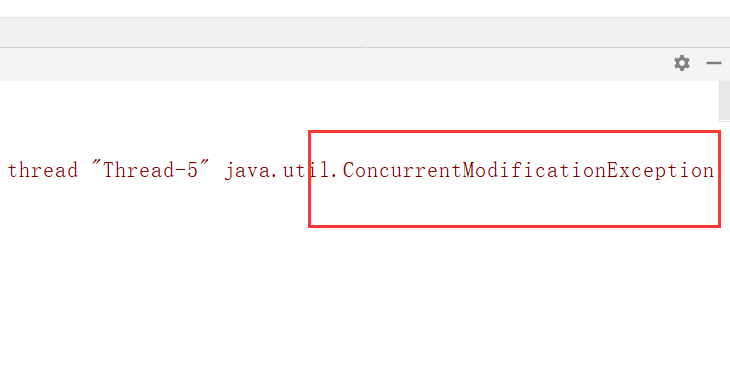

# jmm


早期解决


mesi缓存一致性协议

cpu总线嗅探机制


1数据会立即同步到主内存;

2 经过总线会触发cpu总线嗅探机制(监听)和mesi混村一致性协议

3 会在store之前该内存操作加锁


不保证原子性(会造成数据丢失)


1juc的变量都是用volatile保证内存可见性

2 cas算法保证数据的原子性(Compare-and-Swap)

cas算法是硬件对于并发操作共享数据的支持

csc包含三个操作数

内存值 V

预估值 A

更新值 B

当且仅当 V==A 时,V=B,否则,将不作任何操作

```java
class ThreadList implements Runnable{
    //private static List<String> list=new ArrayList<>();会报concurrentMidificationExecption
    private static List<String> list=new CopyOnWriteArrayList<>();//写入并复制,添加效率低因为每次都会添加都会复制,开销大,不推荐,如果并发迭代可以用
    
    static {
        list.add("aa");
        list.add("bb");
        list.add("cc");
    }
    @Override
    public void run() {
        Iterator<String> iterator=list.iterator();
        while (iterator.hasNext()){
            System.out.println(iterator.next());
            list.add("ee");
        }

    }
}
```



CountDownLatch(闭锁)相似.join();


```java
class TestCountDownLatch implements Runnable{
    private CountDownLatch contDownLatch;//用于在哪个线程之前或线程之后执行

    public TestCountDownLatch(CountDownLatch contDownLatch) {
        this.contDownLatch = contDownLatch;
    }
    @Override
    public void run() {
        synchronized (this){
            try {
                for (int i = 0; i < 50000; i++) {
                    if (i % 2 == 0) {
                        System.out.println(i);
                    }
                }
            }finally {
                contDownLatch.countDown();
            }
        }
    }
}
//main
 CountDownLatch latch = new CountDownLatch(5);
        TestCountDownLatch countDownLatch=new TestCountDownLatch(latch);
        long start= (int) System.currentTimeMillis();
        for (int i = 0; i <5 ; i++) {
            new Thread(countDownLatch).start();
        }
        try {
            latch.await();
        } catch (InterruptedException e) {
            e.printStackTrace();
        }
        long end=System.currentTimeMillis();
        System.out.println("时间是:"+(end-start)*24);


    }

```

