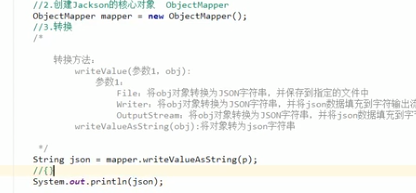

# jquery

jquery是一个js库,链式编程:

入口函数:

```js
$(document).ready(function(){

});
$(function(){
    
});
//window.onload只能写一个
//jquery入口函数可以写多个,且juqery函数比js入口函数执行的快;
//jquery需要页面所有的dom树加载完执行,window.onload()需要所有的页面资源加载完成后执行.
//如果报错 $ is not defined 则是jquery文件没有引入

```


dom对象和jquery对象

```
dom对象,原生的js选择器获取到的对象.只能调用dom的方法,jquery获取到的对象是伪数组,是dom对象的包装集.
dom对象转成jquery对象.
	var div1=document.getElementById("one");
	var $div1=$(div1);
jquery对象得到dom对象,使用下表.
	var $div1=$('div');
	var div1=$div1[0];
	使用get方法
	var div2=$div1.get(1);

```

jquery选择器:

```

```


下拉菜单:

```html
<div class="wrop" style="">
		<ul>
			<li>
				<a href="">一级菜单</a>
				<ul>
					<li><a href="">二级菜单</a></li>
					<li><a href="">二级菜单</a></li>
				</ul>
			</li>
		</ul>
		</div>
	$(function(){
				$(".wrop>ul>li").mouseover(function(){
					$(this).children("ul").show();
				})
				$(".wrop>ul>li").mouseout(function(){
					$(this).children("ul").hide();
				})
			})
```

突出显示:


jquery方法:

```
.text(); 不给参数是获取文本,获取标签中所有的文本,包含其后代元素文本
.text(参数);设置文本,如果文本中有html不会被解析.
.css();设置和获取样式,获取样式需要给参数名,如,width,height,background,包含多个dom元素,则只能获取到第一个.
.show() 更改display属性为block,有参数,表示动画显示如:(2000,function(){
})
.hide(),更改display属性为none,和show()为一组
.toggle(时间参数),如果元素隐藏就动画显示,如果显示就动画隐藏
.mouseover();事件在鼠标移动到选取的元素及其子元素上时触发
.mouseenter();在鼠标移动到选取元素上触发,并不影响其子元素
.mouseleave()和mouseenter是一对
.addclass( 多个参数用空格隔开) addclass("fontsize30 color")
.removeclass()
.hasclass() boolean类型
.toggleClass() 切换类,能够让没有的加上,有的去掉.


```


tab栏切换:


### jquery的动画:

三组基本动画:

```
显示: show()与隐藏hide()是一组动画,toggle切换
滑入(slideDown)与滑出(slideUp)切换(slideToggle),效果与卷帘门类似
淡出(fadeln)与淡出(fadeOut)与切换(fadeToggle)
.stop()不写参数默认为false
```


### jquery创建节点:

```
html()获取到元素的所有内容,有参数,则设置内容如:html("hello world");若设置的内容包含文本,则会被浏览器解析.
$()能够创建元素,只存在与内存中,需要追加使用append()方法.
添加节点的方式:
	append()父元素添加到最后作为子元素.将以存在的元素追加到最后,相当于剪切.
	prepend();父元素添加到最前面作为子元素.将以存在的元素放在最前面,相当于剪切.
	before();A.before(元素b),将元素b放在元素a之前,a和b是兄弟元素.
	after();A.after(元素b),将元素b放在a之后.
	appendTo();子元素.appendTo(子元素),在子元素最后添加子元素.
移除节点和清空节点的方式:
	empty(),清空元素和事件
	找到的元素.remove() 自杀;
	克隆节点: .clone() ;显示需要append追加,有两个参数,true和false选择哪个都会复制其子节点.true表示带事件一起复制.false不会复制事件 ,默认是false
	
```


```
val()不给参数,是获取内容,有参数是设置如$input.val("hello world");
```

### jquery操作属性:

```
设置属性:
	attr(),两个参数,第一个属性名称,第二个值,如果原来没有属性则添加一个属性.
移除属性:
	removeAttr();
	prop()获取boolean类型的数据.如checked.
	prop("checked",true)表示选中
	.width() //不包括宽高
	.height()
	.innerwidth()//包含内边距
	.innerheight()
	.outerWidth()//包含外边距
	.outerHeight()
	.outerWidth(true)//包含边框
	获取页面可视区域()
	$(window).width();
	$(window).height();
	
```


### offset和position

```
offset//距离document的距离
position//相对于定位父集的位置.
scrollleft()左边卷曲的距离
scrolltop()顶部卷曲的距离
设置页面卷曲的距离
	$(window).scrolltop(1000)
	$(window).scrollleft(1000)
```

jquery注册事件:


事件触发:


事件对象:

```
$(select).on("click",function(e){
e获取了事件对象
e.screenX;屏幕坐标到 触发事件的那一点的距离
e.ClientX;页面可视区域到事件触发的距离
e.pageY触发事件那一点到页面左上角的值

})
```


对象.end()方法,回到jquery上一次对象的状态


jq22 获取插件.


对象转json




json数据格式


