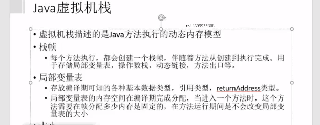

#  JVM

1      什么是java虚拟机，什么是java的虚拟机实例？java的虚拟机相当于我们的一个java类，而java虚拟机实例，相当我们new一个java类，不过java虚拟机不是通过new这个关键字而是通过java.exe或者javaw.exe来启动一个虚拟机实例。

2      java虚拟机的生命周期，当一个java应用main函数启动时虚拟机也同时被启动，而只有当在虚拟机实例中的所有非守护进程都结束时，java虚拟机实例才结束生命。

3  java的虚拟机种有两种线程，一**种叫守护线程，一种叫非守护线程**，main函数就是个非守护线程，虚拟机的gc就是一个守护线程。java的虚拟机中，只要有任何非守护线程还没有结束，java虚拟机的实例都不会退出，所以即使main函数这个非守护线程退出，但是由于在main函数中启动的匿名线程也是非守护线程，它还没有结束，所以jvm没办法退出
4

jvm





      

### 类加载器

​            类从被加载到虚拟机内存中开始，到卸载出内存为止，它的生命周期包括了：加载(Loading)、验证(Verification)、准备(Preparation)、解析(Resolution)、初始化(Initialization)、使用(Using)、卸载(Unloading)七个阶段，其中验证、准备、解析三个部分统称链接。
加载 

​			其中加载将.class加载到方法区转换为jvm能识别的数据结构,同时在堆里创建此类的对象,这个对象作为程序访问方法区中的这些类型数据的外部接口。

验证阶段

确保class文件的字节流中包含的信息符合当前虚拟机的要求

主要包括四个检验过程：**文件格式验证、元数据验证、字节码验证和符号引用验证**

**准备**

​	准备阶段是正式为类变量分配内存并设置类变量初始值的阶段，这些内存都将在方法区中进行分配。这个阶段中有两个容易产生混淆的知识点，首先是这时候进行内存分配的**仅包括类变量(static 修饰的变量),**而不包括实例变量，实例变量将会在对象实例化时随着对象一起分配在java堆中。其次是这里所说的初始值“通常情况”下是数据类型的零值，假设一个类变量定义为:

public static int value  = 12;

那么**变量value在准备阶段过后的初始值为0而不是12**，因为这时候尚未开始执行任何java方法，而把value赋值为123的putstatic指令是程序被编译后，存放于类构造器<clinit>()方法之中，所以把value赋值为12的动作将在初始化阶段才会被执行。
解析(了解)

解析阶段是虚拟机常量池内的**符号引用**替换为**直接引用**的过程

符号引用：符号引用是一组符号来描述所引用的目标对象，符号可以是任何形式的字面量，只要使用时能无歧义地定位到目标即可。符号引用与虚拟机实现的内存布局无关，引用的目标对象并不一定已经加载到内存中。

直接引用：直接引用可以是直接指向目标对象的指针、相对偏移量或是一个能间接定位到目标的句柄。直接引用是与虚拟机内存布局实现相关的，同一个符号引用在不同虚拟机实例上翻译出来的直接引用一般不会相同，**如果有了直接引用，那引用的目标必定已经在内存中存在**

**初始化**

类加载最后阶段，若该类**具有超类，则对其进行初始化**，执行静态初始化器和**静态初始化成员变量**(如前面只初始化了默认值的static变量将会在这个阶段赋值，成员变量也将被初始化)

​       **类加载器的任务是根据一个类的全限定名来读取此类的二进制字节流到JVM中，然后转换为一个与目标类对应的java.lang.Class对象实例，在虚拟机提供了4种类加载器，启动（Bootstrap ClassLoader）类加载器、扩展（Extension ClassLoader）类加载器、应用程序（Application ClassLoader）类加载器、自定义（User ClassLoader）类加载器。**

1.启动类加载器：这个类加载器负责放在<JAVA_HOME>\lib目录中的，或者被-Xbootclasspath参数所指定的路径中的，并且是虚拟机识别的类库。用户无法直接使用。

2.扩展类加载器：这个类加载器由sun.misc.Launcher$AppClassLoader实现。它负责<JAVA_HOME>\lib\ext目录中的，或者被java.ext.dirs系统变量所指定的路径中的所有类库。用户可以直接使用。

3.应用程序类加载器：这个类由sun.misc.Launcher$AppClassLoader实现。是ClassLoader中getSystemClassLoader()方法的返回值。它负责用户路径（ClassPath）所指定的类库。用户可以直接使用。如果用户没有自己定义类加载器，默认使用这个。

4.自定义加载器：用户自己定义的类加载器。

**执行引擎必须把字节码转换成可以直接被JVM执行的语言**

###   运行时数据区

**方法区,堆,栈,本地方法栈,pc寄存器**

线程中止会释放掉java栈,pc计数器,和本地方法库,java程序运行结束会终止方法区和堆

#### **方法区:**

有时候也称为**永久代**（Permanent Generation），在方法区中，存储了每个类的信息（**包括类的名称、修饰符、方法信息、字段信息）、类中静态变量、类中定义为final类型的常量、类中的Field信息、类中的方法信息以及编译器编译后的代码等**。当开发人员在程序中通过Class对象中的getName、isInterface等方法来获取信息时，这些数据都来源于方法区域，同时方法区域也是全局共享的，在一定的条件下它也会被GC，在这里**进行的GC主要是方法区里的常量池和类型的卸载**。当方法区域需要使用的内存超过其允许的大小时，会抛出OutOfMemory的错误信息。

在方法区中有一个非常重要的部分就是**运行时常量池**，用于存放**静态编译产生的字面量和符号引用**。运行时生成的常量也会存在这个常量池中，比如String的intern方法。它是每一个类或接口的常量池的运行时表示形式，在类和接口被加载到JVM后，对应的运行时常量池就被创建出来。
堆

​           用来存储**对象实例**以及**数组**（当然，数组引用是存放在Java栈中的）。堆是被所有线程共享的，因此在其上进行对象内存的分配均需要进行加锁，这也导致了new对象的开销是比较大的。在JVM中只有一个堆。**堆是Java垃圾收集器管理的主要区域，Java的垃圾回收机制会自动进行处理**。

​            Sun Hotspot JVM为了提升对象内存分配的效率，对于**所创建的线程都会分配一块独立的空间TLAB（Thread Local Allocation Buffer**），其大小由JVM根据运行的情况计算而得，在TLAB上分配对象时不需要加锁，因此**JVM在给线程的对象分配内存时会尽量的在TLAB上分配**，在这种情况下JVM中分配对象内存的性能和C基本是一样高效的，但如果对象过大的话则仍然是直接使用堆空间分配。


#### 堆空间

堆空间分为**老年代和年轻代**。刚创建的对象存放在年轻代，而老年代中存放生命周期长久的实例对象。年轻代中又被分为Eden区和两个Survivor区(From Space和To Space)。新的对象分配是首先放在Eden区，Survivor区作为Eden区和Old区的缓冲，在Survivor区的对象经历若干次GC仍然存活的，就会被转移到老年代。 当一个对象大于eden区而小于old区（老年代）的时候会直接扔到old区。 而当对象大于old区时，会直接抛出OutOfMemoryError（OOM）


#### **栈**

Java栈也称作**虚拟机栈**（Java Vitual Machine Stack），也就是我们常常所说的栈。JVM栈是线程私有的，每个线程创建的**同时都会创建自己的JVM栈，互不干扰。**

Java栈是Java方法执行的内存模型。Java栈中存放的是一个个的栈帧，每个栈帧对应一个被调用的方法，在栈帧中包括**局部变量表(Local Variables)、操作数栈(Operand Stack)、指向当前方法所属的类的运行时常量池的引用(Reference to runtime constant pool)、方法返回地址(Return Address)和一些额外的附加信息。**当线程执行一个方法时，就会随之创建一个对应的栈帧，并将建立的栈帧压栈。当方法执行完毕之后，便会将栈帧出栈。因此可知，线程当前执行的方法所对应的栈帧必定位于Java栈的顶部。

**局部变量表**：用来存储方法中的**局部变量（**包括在方法中声明的**非静态变量以及函数形参**）。对于基**本数据类型的变量，则直接存储它的值**，对于**引用类型的变量，则存的是指向对象的引用**。**局部变量表的大小在编译期就可以确定其大小了，因此在程序执行期间局部变量表的大小是不会改变的**。

**操作数栈**：栈最典型的一个应用就是用来对表达式求值。在一个线程执行方法的过程中，实际上就是不断执行语句的过程，而归根到底就是进行计算的过程。因此可以这么说，程序中的所有计算过程都是在借助于操作数栈来完成的。

**指向运行时常量池的引用**：因为在方法执行的过程中有可能需要用到类中的常量，所以必须要有一个引用指向运行时常量。

**方法返回地址**：当一个方法执行完毕之后，要返回之前调用它的地方，因此在栈帧中必须保存一个方法返回地址。

### pc寄存器

程序计数器（Program Counter Register），也有称作为PC寄存器。

由于在JVM中，多线程是通过线程轮流切换来获得CPU执行时间的，因此，在任一具体时刻，一个CPU的内核只会执行一条线程中的指令，因此，为了能够使得每个线程都在线程切换后能够恢复在切换之前的程序执行位置，每个线程都需要有自己独立的程序计数器，并且不能互相被干扰，否则就会影响到程序的正常执行次序。因此，可以这么说，程序计数器是每个线程所私有的。

​           **在JVM规范中规定，如果线程执行的是非native（本地）方法，则程序计数器中保存的是当前需要执行的指令的地址；如果线程执行的是native方法，则程序计数器中的值是undefined。**

**由于程序计数器中存储的数据所占空间的大小不会随程序的执行而发生改变，因此，对于程序计数器是不会发生内存溢出现象(OutOfMemory)的。**

### 本地方法栈

​           JVM采用本地方法堆栈来支持native方法的执行，此区域用于存储每个native方法调用的状态。本地方法栈与Java栈的作用和原理非常相似。区别只不过是Java栈是为执行Java方法服务的，而本地方法栈则是为执行本地方法（Native Method）服务的。在JVM规范中，并没有对本地方法栈的具体实现方法以及数据结构作强制规定，虚拟机可以自由实现它。在HotSopt虚拟机中直接就把本地方法栈和Java栈合二为一
**jvm潜在异常:**

栈

StackOverflowError ：栈深度大于虚拟机所允许的深度

 OOM ：如果虚拟机栈可以动态扩展（当前大部分Java虚拟机都可以动态扩展，只不过Java虚拟机规范中的也允许固定长度的虚拟机栈），如果扩展是无法申请到足够的内存

本地方法栈

StackOverflowError ：栈深度大于虚拟机所允许的深度

OOM 

堆

OOM (out of memory)

方法区

OOM

### 类加载机制

Class文件由类装载器装载后，在JVM中将形成一份描述Class结构的元信息**对象**，通过该元信息对象可以获知Class的结构信息：如构造函数，属性和方法等，Java允许用户借由这个Class相关的元信息**对象**间接调用Class对象的功能。

**虚拟机把描述类的数据从class文件加载到内存，并对数据进行校验，转换解析和初始化，最终形成可以被虚拟机直接使用的Java类型，这就是虚拟机的类加载机制**

### 类加载时机

当应用程序启动的时候，所有的类会被一次性加载吗？估计你早已知道答案，当然不能，因为如果一次性加载，内存资源有限，可能会影响应用程序的正常运行。那类什么时候被加载呢？例如，A a=new A()，一个类真正被加载的时机是在创建对象的时候，才会去执行以上过程，加载类。当我们测试的时候，最先加载拥有main方法的主线程所在类。


### 类初始化时机

主动引用的五种情况（发生类初始化过程）

使用**new**字节码指令创建类的实例，或者使用getstatic、putstatic读取或设置一个静态字段的值（放入常量池中的常量除外），或者调用一个静态方法的时候，对应类必须进行过初始化。
通过**java.lang.reflect**包的方法对类进行反射调用的时候，如果类没有进行过初始化，则要首先进行初始化。
当初始化一个类的时候，如果发现其**父类**没有进行过初始化，则首先触发**父类初始化**。
       当虚拟机启动时，用户需要指定一个**主类（**包含main()方法的类），虚拟机会首先**初始化这**个类。
使用jdk1.7的动态语言支持时，如果一个**java.lang.invoke.MethodHandle实例**最后的解析结果REF_getStatic、REF_putStatic、RE_invokeStatic的方法句柄，并且这个方法句柄对应的类没有进行初始化，则需要先触发其**初始化。**


被动引用的情况

**当访问一个静态变量时，只有真正声明这个变量的类才会初始化。(****子类调用父类的静态变量，只有父类初始化，子类不初始化)**

**通过数组定义类引用，不会触发此类的初始化**。

```
//父类    
public class SuperClass {    
    //静态变量value    
    public static int value = 666;    
    //静态块，父类初始化时会调用    
    static{    
        System.out.println("父类初始化！");    
    }    
}    
    
//主类、测试类    
public class NotInit {    
    public static void main(String[] args){    
        SuperClass[] test = new SuperClass[10];    
    }    
}    
```

**静态常量不会触发此类的初始化，因为在编译阶段就存储在常量池中，****不会引用到定义常量的类。

```
//常量类    
public class ConstClass {    
    static{    
        System.out.println("常量类初始化！");    
    }    
        
    public static final String HELLOWORLD = "hello world!";    
}    
    
//主类、测试类    
public class NotInit {    
    public static void main(String[] args){    
        System.out.println(ConstClass.HELLOWORLD);    
    }    
}  
```

### jvm垃圾回收机制

将内存中不再被使用的对象进行回收，GC中用于回收的方法称为收集器，由于GC需要消耗一些资源和时间，Java在对对象的生命周期特征进行分析后，**按照新生代、旧生代的方式来对对象进行收集，以尽可能的缩短GC对应用造成的暂停**

Java堆区和方法区,**正是垃圾收集器所需关注的部分**

#### **引用计数法**

  **堆中每个对象实例都有一个引用计数**。**当一个对象被创建时，就将该对象实例分配给一个变量，该变量计数设置为1**

​         引用计数是垃圾收集器中的早期策略。在这种方法中，堆中每个对象实例都有一个引用计数。当一个对象被创建时，就将该对象实例分配给一个变量，该变量计数设置为1。当任何其它变量被赋值为这个对象的引用时，计数加1（a = b,则b引用的对象实例的计数器+1），但当一个对象实例的某个引用超过了生命周期或者被设置为一个新值时，对象实例的引用计数器减1。任何引用计数器为0的对象实例可以被当作垃圾收集。当一个对象实例被垃圾收集时，它引用的任何对象实例的引用计数器减1。

简 堆中每个对象都有变量计数1,引用一次+1,被赋为新值时,将会-1或者超过生命周期时-1,最终会变为0,被收走

### **可达性分析法**

从gc root开始寻找对应的引用节点,最终没被引用到的节点,被判定为回收

在Java语言中，可作为GC Roots的对象包括下面几种：

  **a) 虚拟机栈中引用的对象（栈帧中的本地变量表）；**

  **b) 方法区中类静态属性引用的对象；**

  **c) 方法区中常量引用的对象；**

  **d) 本地方法栈中JNI（Native方法）引用的对象。**

不同的对象引用类型， GC会采用不同的方法进行回收，JVM对象的引用分为了四种类型：

**强引用**

在程序代码中普遍存在的，类似**Object obj=new Object()**这类引用，只要强引用还存在，垃圾收集器永远不会回收掉被引用的对象。

**软引用**

用来描述一些还有用但并非必须的对象。对于软引用关联着的对象，在**系统将要发生内存溢出异常之前，将会把这些对象列进回收范围之中进行第二次回收**。如果这次回收后还没有足够的内存，才会抛出内存溢出异常

**弱引用**(也就是弱引用一定会被回收)

也是用来描述非必需对象的，但是它的强度比软引用更弱一些，被弱引用关联的对象只能生存到下一次垃圾收集发生之前。当垃圾收集器工作时，无论当前内存是否足够，都会回收掉只被弱引用关联的对象

虚引用

也叫幽灵引用或幻影引用（名字真会取，很魔幻的样子），是最弱的一种引用关系。一个对象是否有虚引用的存在，完全不会对其生存时间构成影响，也无法通过虚引用来取得一个对象实例。它的作用是能**在这个对象被收集器回收时收到一个系统通知**（用来得知对象是否被GC）

**引用计数算法和可达性分析算法都是基于强引用的**

对于不可达的对象,处于缓刑,要真正宣告一个对象死亡，至少要经历两次标记过程

**第一次标记**：如果对象在进行可达性分析后发现没有与GC Roots相连接的引用链，那它将会被第一次标记；


**第二次标记**：第一次标记后接着会进行一次筛选，筛选的条件是此对象是否有必要执行finalize（）方法，在finalize（）方法中没有重新与引用链建立关联关系的，将被进行第二次标记。

第二次标记成功的对象将真的会被回收，如果对象在finalize（）方法中重新与引用链建立了关联关系，那么将会逃离本次回收，继续存活

**方法区判定回收**

方法区主要回收的内容有：**废弃常量和无用的类**。对于废弃常量也可通过引用的可达性来判断，但是对于无用的类则需要同时满足下面3个条件：

（1）该类所有的实例都已经被回收，也就是Java堆中不存在该类的任何实例

（2）**加载该类的ClassLoader已经被回收**

（3）该类对应的**java.lang.Class对象没有在任何地方被引用**，无法在任何地方通过反射访问该类的方法

### **常用的垃圾回收算法**

##### 1  **标记清除算法**


缺点: 产生太多零碎内存空间,当分配较大对象时无法找到足够的连续内存而不得不提前出发另一次垃圾收集动作,,且效率不高

##### **2  复制算法**

​        这种算法虽然实现简单，运行高效且不容易产生内存碎片，但是却对内存空间的使用做出了高昂的代价，因为能够使用的内存缩减到原来的一半。

很显然，**Copying算法的效率跟存活对象的数目多少有很大的关系，如果存活对象很多，那么Copying算法的效率将会大大降低**。


##### **3  标记整理算法**

​        该算法标记阶段和Mark-Sweep一样，但是在完成标记之后，它不是直接清理可回收对象，而是将存活对象都向一端移动，然后清理掉端边界以外的内存。


##### **4  分代收集算法**

​        分代收集算法是目前大部分JVM的垃圾收集器采用的算法。它的核心思想是根据对象存活的生命周期将内存划分为若干个不同的区域。一般情况下将堆区划分为**老年代（Tenured Generation）和年轻代（Young Generation），在堆区之外还有一个代就是永久代（Permanet Generation），它用来存储class类、常量、方法描述等。对永久代的回收主要回收两部分内容：废弃常量和无用的类。**

​       **老年代的特点是每次垃圾收集时只有少量对象需要被回收**，**而年轻代的特点是每次垃圾回收时都有大量的对象需要被回收**，那么就可以根据不同代的特点采取最适合的收集算法

##### **5  年轻代的回收算法**

所有新生成的对象首先都是放在年轻代的。年轻代的目标就是尽可能快速的收集掉那些生命周期短的对象。

b）年轻代分三个区。一个Eden区，两个 Survivor区(一般而言)。大部分对象在Eden区中生成。当Eden区满时，还存活的对象将被复制到Survivor区（两个中的一个），当这个 Survivor区满时，此区的存活对象将被复制到另外一个Survivor区，当另外一个Survivor区也满了的时候，从第一个Survivor区复制过来的并且此时还存活的对象，将被复制到“年老区(Tenured)”。需要注意，Survivor的两个区是对称的，没先后关系，所以同一个区中可能同时存在从Eden复制过来对象，和从前一个Survivor复制过来的对象，而复制到年老区的只有从第一个Survivor区过来的对象。而且，Survivor区总有一个是空的。

c）当survivor1区不足以存放 eden和survivor0的存活对象时，就将存活对象直接存放到老年代。若是老年代也满了就会触发一次Full GC，也就是新生代、老年代都进行回收。

d）新生代发生的GC也叫做**Minor GC**，MinorGC发生频率比较高(不一定等Eden区满了才触发)。


##### **6  老年代的回收算法**

老年代的特点是每次回收都只回收少量对象，一般使用的是Mark-Compact（标记-整理）算法。

a）在年轻代中经历了N次垃圾回收后仍然存活的对象，就会被放到年老代中。因此，可以认为年老代中存放的都是一些生命周期较长的对象。

b）内存比新生代也大很多(大概比例是1:2)，当老年代内存满时触发**Major GC或Full GC**，**Full GC**发生频率比较低，老年代对象存活时间比较长，存活率标记高。


##### **7  永久代的回收算法**

​         永久代(permanent generation)也称为“方法区(method area)”，他存储class对象和字符串常量。所以这块内存区域绝对不是永久的存放从老年代存活下来的对象的。在这块内存中有可能发生垃圾回收。发生在这里垃圾回收也被称为**major GC**


### 常见的垃圾收集器

##### 1  Serial收集器(复制算法)

**新生代单线程收集器**，**标记和清理都是单线程，优点是简单高效。单线程一方面意味着它只会使用一个CPU或一条线程去完成垃圾收集工作，另一方面也意味着它进行垃圾收集时必须暂停其他线程的所有工作，直到它收集结束为止**。是client级别默认的GC方式，可以通过-XX:+UseSerialGC来强制指定

**说明：1. 需要STW（Stop The World），停顿时间长。2. 简单高效，对于单个CPU环境而言，Serial收集器由于没有线程交互开销，可以获取最高的单线程收集效率。**


##### 2  **Serial-old收集器(标记整理算法)**


**老年代单线程收集器，Serial收集器的老年代版本。****它的优点是实现简单高效，但是缺点是会给用户带来停顿**

3  PerNew收集器(复制算法)

​        **新生代收集器**，可以认为是**Serial收集器的多线程版本**，使用多个线程进行垃圾收集,在多核CPU环境下有着比Serial更好的表现。是Server模式下的虚拟机首选的新生代收集器，其中有一个很重要的和性能无关的原因是，除了Serial收集器外，目前只有它能与CMS收集器配合工作。它默认开启的收集线程数与CPU数量相同，在CPU数量非常多的情况下，可以使用-XX:ParallelGCThreads参数来限制垃圾收集的线程数


##### **4  Parallel  Scavenge收集器(复制算法)**

Parallel Scavenge收集器是一个**新生代的多线程收集器**（并行收集器），**它在回收期间不需要暂停其他用户线程**，其采用的是Copying算法。它追求高吞吐量，高效利用CPU，主要是为了达到一个可控的吞吐量。Parallel Scavenge收集器是虚拟机运行在Server模式下的默认垃圾收集器。Parallel Scavenge收集器也被称为“**吞吐量优先收集器**


适合后台应用等对交互相应要求不高的场景。是**server级别默认采用的GC方式**，可用-XX:+UseParallelGC来强制指定，用-XX:ParallelGCThreads=4来指定线程数。


##### **5  Parallel Old收集器(标记整理算法)**

Parallel Scavenge收集器的**老年代**版本，**并行收集器**，**吞吐量优先**。使用**多线程**和标记-整理（Mark-Compact）算法。


##### **6  CMS 收集器(标记清除算法)**

​       CMS（Current Mark Sweep）收集器是一种**以获取最短回收停顿时间为目标**的收集器，它是一种**并发****收集器**，采用的是Mark-Sweep算法。**高并发、低停顿，追求最短GC回收停顿时间**，cpu占用比较高，响应时间快，停顿时间短，多核cpu 追求高响应时间的选择

收集过程分为如下四步：

(1). 初始标记，标记GCRoots能直接关联到的对象，时间很短。

(2)**. 并发标记**，进行GCRoots Tracing（可达性分析）过程，时间很长。

(3). 重新标记，修正并发标记期间因用户程序继续运作而导致标记产生变动的那一部分对象的标记记录，时间较长。

(4). **并发清除**，回收内存空间，时间很长。

其中，并发标记与并发清除两个阶段耗时最长，但是可以与用户线程并发执行

说明：1. 对**CPU资源非常敏感**，可能会导致应用程序变慢，吞吐率下降。2. **无法处理浮动垃圾**，因为在并发清理阶段用户线程还在运行，自然就会产生新的垃圾，而在此次收集中无法收集他们，只能留到下次收集，这部分垃圾为浮动垃圾，同时，由于用户线程并发执行，所以需要预留一部分老年代空间提供并发收集时程序运行使用。3. 由于采用的标记 - 清除算法，会**产生大量的内存碎片，不利于大对象的分配，可能会提前触发一次Full GC**。虚拟机提供了-XX:+UseCMSCompactAtFullCollection参数来进行碎片的合并整理过程，这样会使得停顿时间变长，虚拟机还提供了一个参数配置，-XX:+CMSFullGCsBeforeCompaction，用于设置执行多少次不压缩的Full GC后，接着来一次带压缩的GC


##### 7 G1 

​        G1收集器是当今收集器技术发展最前沿的成果，它是一款**面向服务端应用的收集器**，它能充分利用多CPU、多核环境。因此它是一款**并行与并发收集器**，并且它能建立可预测的停顿时间模型

(1). **并行和并发**。使用多个CPU来缩短Stop The World停顿时间，与用户线程并发执行。

(2). **分代收集**。独立管理整个堆，但是能够采用不同的方式去处理新创建对象和已经存活了一段时间、熬过多次GC的旧对象，以获取更好的收集效果。

(3). **空间整合**。基于**标记 - 整理算法**，无内存碎片产生。

(4). **可预测的停顿**。能建立可预测的停顿时间模型，能让使用者明确指定在一个长度为M毫秒的时间片段内，消耗在垃圾收集上的时间不得超过N毫秒。

使用G1收集器时，Java堆的内存布局与其他收集器有很大差别，它将整个Java堆划分为多个大小相等的独立区域（Region），虽然还保留有新生代和老年代的概念，**但新生代和老年代不再是物理隔离的了，它们都是一部分（可以不连续）Region的集合**

**Minor GC、Full GC触发条件**

**Eden区域满了，或者新创建的对象大小 > Eden所剩空间**
**CMS设置了CMSScavengeBeforeRemark参数，这样在CMS的Remark之前会先做一次Minor GC来清理新生代，加速之后的    Remark的速度。这样整体的stop-the-world时间反而短**
**Full GC的时候会先触发Minor GC**

### full gc 的触发条件

Minor GC后存活的对象晋升到老年代时由于悲观策略的原因，有两种情况会触发Full GC, 一种是之前每次**晋升的对象的平均大小 > 老年代剩余空间**；一种**是Minor GC后存活的对象超过了老年代剩余空间**。这两种情况都是因为老年代会为新生代对象的晋升提供担保，而每次晋升的对象的大小是无法预测的，所以只能基于统计，一个是基于历史平均水平，一个是基于下一次可能要晋升的最大水平。这两种情况都是属于**promotion failure**

CMS失败，**发生concurrent mode failure会引起Full GC**，这种情况下会使用Serial Old收集器，是单线程的，对GC的影响很大。concurrent mode failure产生的原因是**老年代剩余的空间不够**，**导致了和gc线程并发执行的用户线程创建的大对象(由PretenureSizeThreshold控制新生代直接晋升老年代的对象size阀值)不能进入到老年代**，只要stop the world来暂停用户线程，执行GC清理。可以通过设置CMSInitiatingOccupancyFraction预留合适的CMS执行时剩余的空间

**新生代直接晋升到老年代的大对象超过了老年代的剩余空间**，引发Full GC。注意于promotion failure的区别，promotion failure指的是Minor GC后发生的担保失败

**Perm永久代空间不足会触发Full GC**，可以让CMS清理永久代的空间。设置CMSClassUnloadingEnabled即可

**System.gc()引起的Full GC**，可以设置DisableExplicitGC来禁止调用System.gc引发Full GC

**结论:**

 Full GC == Major GC   指的是对老年代/永久代的stop the world的GC

2. Full GC的次数 = 老年代GC时 stop the world的次数

3. Full GC的时间 = 老年代GC时 stop the world的总时间

4. CMS 不等于Full GC，我们可以看到CMS分为多个阶段，只有**stop the world的阶段被计算到了Full GC的次数和时间**，而和业务线程并发的GC的次数和时间则不被认为是Full GC

5. **Full GC本身不会先进行Minor GC，我们可以配置，让Full GC之前先进行一次Minor GC，因为老年代很多对象都会引用到新生代的对象，先进行一次Minor GC可以提高老年代GC的速度**。比如老年代使用CMS时，设置CMSScavengeBeforeRemark优化，让CMS remark之前先进行一次Minor GC。

Heap什么时候会发生OOM

- 当**花在GC的时间超过了GCTimeLimit**，这个值默认是98%
- 当**GC后的容量小于GCHeapFreeLimit**，这个值默认是2%

**stop-the-world**

不管选择哪种GC算法，stop-the-world都是不可避免的。**Stop-the-world意味着从应用中停下来并进入到GC执行过程中去。一旦Stop-the-world发生，除了GC所需的线程外，其他线程都将停止工作，中断了的线程直到GC任务结束才继续它们的任务。GC调优通常就是为了改善stop-the-world的时间。**


### **gc调优**

最关键参数：-Xms、 -Xmx 、-Xmn 、-XX:SurvivorRatio、-XX:MaxTenuringThreshold、-XX:PermSize、-XX:MaxPermSize

-Xms、 -Xmx 通常设置为相同的值，避免运行时要不断扩展JVM内存，这个值决定了JVM heap所能使用的最大内存。

-Xmn 决定了新生代空间的大小，新生代Eden、S0、S1三个区域的比率可以通过-XX:SurvivorRatio来控制(假如值为 4  表示：Eden:S0:S1 = 4:3:3 )

-XX:MaxTenuringThreshold 控制对象在经过多少次minor GC之后进入老年代，此参数只有在Serial 串行GC时有效。

-XX:PermSize、-XX:MaxPermSize 用来控制方法区的大小，通常设置为相同的值。

**1.避免新生代大小设置过小**

当新生代设置过小时，会产生两种比较明显的现象，一是minor GC次数频繁，二是可能导致 minor GC对象直接进入老年代。当老年代内存不足时，会触发Full GC。

**2.避免新生代大小设置过大**

新生代设置过大，会带来两个问题：一是老年代变小，可能导致Full  GC频繁执行；二是 minor GC 执行回收的时间大幅度增加。

**3.避免Survivor区过大或过小**

-XX:SurvivorRatio参数的值越大，就意味着Eden区域变大，minor GC次数会降低，但两块Survivor区域变小，如果超过Survivor区域内存大小的对象在minor GC后仍没被回收，则会直接进入老年代，

-XX:SurvivorRatio参数值设置过小，就意味着Eden区域变小，minor GC触发次数会增加，Survivor区域变大，意味着可以存储更多在minor GC后任存活的对象，避免其进入老年代。

**4.合理设置对象在新生代存活的周期**

新生代存活周期的值决定了新生代对象在经过多少次Minor GC后进入老年代。因此这个值要根据自己的应用来调优，Jvm参数上这个值对应的为-XX:MaxTenuringThreshold，默认值为15次
**jvm所产生生的异常**

stack,outofmemory ,oom,memory leak,,promotion failure(晋升失败),concurrent mode failure(老年代空间不足)

### **减少gc**

​             1)**不要显式调用System.gc()。**此函数建议JVM进行主GC,虽然只是建议而非一定,但很多情况下它会触发主GC,从而增加主GC的频率,也即增加了间歇性停顿的次数。大大的影响系统性能。

　　　  2)**尽量减少临时对象的使用。**临时对象在跳出函数调用后,会成为垃圾,少用临时变量就相当于减少了垃圾的产生,从而延长了出现上述第二个触发条件出现的时间,减少了主GC的机会。

　　　　3)**对象不用时最好显式置为Null。**一般而言,为Null的对象都会被作为垃圾处理,所以将不用的对象显式地设为Null,有利于GC收集器判定垃圾,从而提高了GC的效率。

　　　　4**)尽量使用StringBuffer,而不用String来累加字符串。**由于String是固定长的字符串对象,累加String对象时,并非在一个String对象中扩增,而是重新创建新的String对象,如Str5=Str1+Str2+Str3+Str4,这条语句执行过程中会产生多个垃圾对象,因为对次作“+”操作时都必须创建新的String对象,但这些过渡对象对系统来说是没有实际意义的,只会增加更多的垃圾。避免这种情况可以改用StringBuffer来累加字符串,因StringBuffer是可变长的,它在原有基础上进行扩增,不会产生中间对象。

　　　　5**)能用基本类型如Int,Long,就不用Integer,Long对象**。基本类型变量占用的内存资源比相应对象占用的少得多,如果没有必要,最好使用基本变量。

　　　　6)**尽量少用静态对象变量**。静态变量属于全局变量,不会被GC回收,它们会一直占用内存。

　　　　7)**分散对象创建或删除的时间**。集中在短时间内大量创建新对象,特别是大对象,会导致突然需要大量内存,JVM在面临这种情况时,只能进行主GC,以回收内存或整合内存碎片,从而增加主GC的频率。集中删除对象,道理也是一样的。它使得突然出现了大量的垃圾对象,空闲空间必然减少,从而大大增加了下一次创建新对象时强制主GC的机会。

### oom

**内存泄漏memory leak** :是指程序在申请内存后，无法释放已申请的内存空间，一次内存泄漏似乎不会有大的影响，但内存泄漏堆积后的后果就是内存溢出。 

**内存溢出 out of memory :**指程序申请内存时，没有足够的内存供申请者使用，或者说，给了你一块存储int类型数据的存储空间，但是你却存储long类型的数据，那么结果就是内存不够用，此时就会报错OOM,即所谓的内存溢出。 


**关系**

内存泄漏的堆积最终会导致内存溢出

内存溢出就是你要的内存空间超过了系统实际分配给你的空间，此时系统相当于没法满足你的需求，就会报内存溢出的错误。
内存泄漏是指你向系统申请分配内存进行使用(new)，可是使用完了以后却不归还(delete)，结果你申请到的那块内存你自己也不能再访问（也许你把它的地址给弄丢了），而系统也不能再次将它分配给需要的程序。就相当于你租了个带钥匙的柜子，你存完东西之后把柜子锁上之后，把钥匙丢了或者没有将钥匙还回去，那么结果就是这个柜子将无法供给任何人使用，也无法被垃圾回收器回收，因为找不到他的任何信息。

内存溢出：一个盘子用尽各种方法只能装4个果子，你装了5个，结果掉倒地上不能吃了。这就是溢出。比方说栈，栈满时再做进栈必定产生空间溢出，叫上溢，栈空时再做退栈也产生空间溢出，称为下溢。就是分配的内存不足以放下数据项序列,称为内存溢出。说白了就是我承受不了那么多，那我就报错，

**内存泄漏**

**常发性内存泄漏**。发生内存泄漏的代码会被多次执行到，每次被执行的时候都会导致一块内存泄漏。
**偶发性内存泄漏**。发生内存泄漏的代码只有在某些特定环境或操作过程下才会发生。常发性和偶发性是相对的。对于特定的环境，偶发性的也许就变成了常发性的。所以测试环境和测试方法对检测内存泄漏至关重要。
**一次性内存泄漏**。发生内存泄漏的代码只会被执行一次，或者由于算法上的缺陷，导致总会有一块仅且一块内存发生泄漏。比如，在类的构造函数中分配内存，在析构函数中却没有释放该内存，所以内存泄漏只会发生一次。
**隐式内存泄漏**。程序在运行过程中不停的分配内存，但是直到结束的时候才释放内存。严格的说这里并没有发生内存泄漏，因为最终程序释放了所有申请的内存。但是对于一个服务器程序，需要运行几天，几周甚至几个月，不及时释放内存也可能导致最终耗尽系统的所有内存。所以，我们称这类内存泄漏为隐式内存泄漏。

**内存溢出的原因及解决方法：**

内存溢出原因： 
1.内存中加载的数据量过于庞大，如一次从数据库取出过多数据； 
2.集合类中有对对象的引用，使用完后未清空，使得JVM不能回收； 
3.代码中存在死循环或循环产生过多重复的对象实体； 
4.使用的第三方软件中的BUG； 
5.启动参数内存值设定的过小
**内存溢出的解决方案：** 
第一步，修改JVM启动参数，直接增加内存。(-Xms，-Xmx参数一定不要忘记加。)

第二步，检查错误日志，查看“OutOfMemory”错误前是否有其 它异常或错误。

第三步，对代码进行走查和分析，找出可能发生内存溢出的位置。

### 对象分配

| Eden Space | From Space | To Space |
| ---------- | ---------- | -------- |
|            |            |          |

内存分配，往大方向上讲就是在堆上分配，**对象主要分配在新生代的Eden Space和From Space**，少数情况下会直接分配在老年代。如果新生代的Eden Space和From Space的空间不足，则会发起一次GC，如果进行了GC之后，Eden Space和From Space能够容纳该对象就放在Eden Space和From Space。在GC的过程中，会将Eden Space和From  Space中的存活对象移动到To Space，然后将Eden Space和From Space进行清理。如果在清理的过程中，To Space无法足够来存储某个对象，就会将该对象移动到老年代中。在进行了GC之后，使用的便是Eden space和To Space了，下次GC时会将存活对象复制到From Space，如此反复循环。当对象在Survivor区躲过一次GC的话，其对象年龄便会加1，默认情况下，如果对象年龄达到15岁，就会移动到老年代中。

　　一般来说，大对象会被直接分配到老年代，所谓的大对象是指需要大量连续存储空间的对象，最常见的一种大对象就是大数组，比如：

　　byte[] data = new byte[4\*1024\*1024]

　　这种一般会直接在老年代分配存储空间。

　　当然分配的规则并不是百分之百固定的，这要取决于当前使用的是哪种垃圾收集器组合和JVM的相关参数
