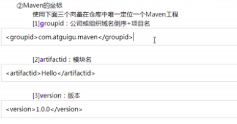
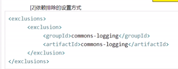

# maven

借助于maven可以以一规范的方式下载jar包,因为所有知名框架或第三方以及按照统一的规范存放在maven的中央仓库中.

1 一个jar包依赖的其他jar包 需要自己手动加到项目中.

2 maven 会自动被依赖的jar包导入进来.

坐标:

两大核心:

1 依赖管理:对jar包的管理

2 项目构建:项目在编码完成后,需要进行相关的操作.

1 构建:

以源文件,框架配置文件,jsp,html,图片,等资源为原材料去生产一个可以运行的项目的过程,

2 编译: java源文件 -class文件-jvm

3部署:

依赖排除:

