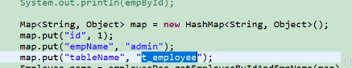
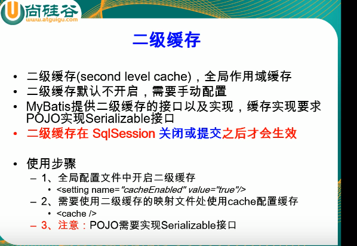

# mybatis

mybatis的第一个查询

目录结构


User.xml配置

```xml
<?xml version="1.0" encoding="UTF-8" ?>
<!DOCTYPE mapper
  PUBLIC "-//mybatis.org//DTD Mapper 3.0//EN"
  "http://mybatis.org/dtd/mybatis-3-mapper.dtd">
  <!-- dao接口的地址 -->
<mapper namespace="com.day01.dao.UserDao">

<!-- 查询 
#{id} 传的id
-->
  <select id="getUser" resultType="com.day01.domain.User">
    select * from test where id = #{id}
  </select>
</mapper>
```

mybatis-config.xml配置

```xml
<?xml version="1.0" encoding="UTF-8" ?>
<!DOCTYPE configuration
  PUBLIC "-//mybatis.org//DTD Config 3.0//EN"
  "http://mybatis.org/dtd/mybatis-3-config.dtd">
<configuration>
  <environments default="development">
    <environment id="development">
      <transactionManager type="JDBC"/>
      <dataSource type="POOLED">
        <property name="driver" value="com.mysql.cj.jdbc.Driver"/>
        <property name="url" value="jdbc:mysql://localhost:3306/test?useSSL=false&amp;serverTimezone=UTC&amp;characterEncoding=utf-8"/>
        <property name="username" value="root"/>
        <property name="password" value="root"/>
      </dataSource>
    </environment>
  </environments>
  <mappers>
    <mapper resource="com/day01/domain/UserDao.xml"/>
  </mappers>
</configuration>
```

实现查询

```java
package com.day01.test;

import java.io.IOException;
import java.io.InputStream;

import org.apache.ibatis.io.Resources;
import org.apache.ibatis.session.SqlSession;
import org.apache.ibatis.session.SqlSessionFactory;
import org.apache.ibatis.session.SqlSessionFactoryBuilder;
import org.junit.Test;

import com.day01.dao.UserDao;
import com.day01.domain.User;

public class MybatisTest {
	@Test
	public void test1() {
		SqlSession session=null;
		try {
			
			InputStream inputStream=Resources.getResourceAsStream("mybatis.xml");
			SqlSessionFactory sessionFactoryBuilder=new	SqlSessionFactoryBuilder().build(inputStream);
			 session=sessionFactoryBuilder.openSession();
			UserDao userDao=session.getMapper(UserDao.class);
			User user=userDao.getUser(134);
			System.out.println(user.toString());
		} catch (IOException e) {
			// TODO Auto-generated catch block
			e.printStackTrace();
		}finally {
			session.close();
		}
		
	}
}

```

全局配置文件

mybatis-config.xml

全局配置文件的标签


properties


settings


typeAliases

为javabean起别名


typeHandlers

类型处理器

​        你可以重写类型处理器或创建你自己的类型处理器来处理不支持的或非标准的类型。 具体做法为：实现 `org.apache.ibatis.type.TypeHandler` 接口， 或继承一个很便利的类 `org.apache.ibatis.type.BaseTypeHandler`， 然后可以选择性地将它映射到一个 JDBC 类型。

plugins


environment 配置具体的环境

每一个环境都需要一个事务管理器和一个数据源


事务和数据源在spring中配置

数据库厂商标识（databaseIdProvider）


mappers  sql映射文件都需要注册


class 引用接口 要求实体的配置文件与接口在同一包下,并且名字相同


resource 引用包名

批量注册


sql映射文件


增删改标签


获取自增主键


获取非自增主键

在插入之前查出最大id+1然后赋值给keyProperty


查询

1 传一个参数

基本类型

​	取值随便写

2 传多个参数

#{参数}无效

可用: 0,1 或param1,param2

原因; mabytis将传入色参数存在map中,取得时候需要用mabitis的吗[

的键取

解决方法: 我们在参数前面加上注解用来告诉mybatis存map的时候用我们指定的键


3 传javabean

#{javabean的属性}取出

4 传入map

将多个参数封装在map中,传入


5 多个值和javabean


${} 和#{} 

#{}支持预编译  安全

${} 是字符串拼串,不安全 在不支持预编译时就使用

​		我们在进行动态传入表名时可以用${}取出




查询返回list


查询一条记录返回map


查询多条记录封装map

​							


自定义查询规则


级联查询


collection


分步查询


按需加载

全局开启按需加载策略(延时加载)


覆盖全局加载


推荐连接查询

动态sql


trim 不推荐

foeeach


choose


set

动态更新


缓存机制

​		mybatis 一级缓存


二级缓存




二级缓存一定是一级缓存提交或关闭后生效


缓存原理


第三方缓存

整合redis,ehcache


1获取到的dao接口是动态代理对象,自动创建

2sqlSessionFactory和sqlsession

sqlSessionFactory只创建一次,sqlSession是每次和数据库进行一次会话,每次都应创建新的sqlSession.


