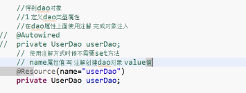
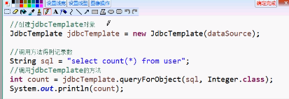
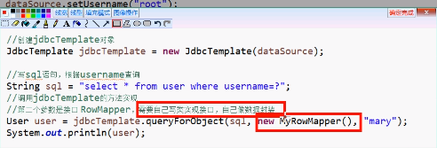
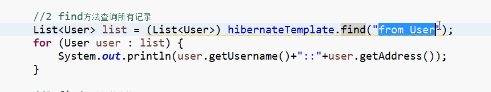
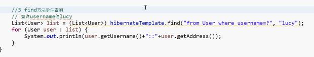

# Spring

1 spring 开源轻量级框架

2 spring 核心主要两部分

aop  面向切口编程,扩展功能不是修改源代码实现

ioc 控制反转  创建对象不是new出来而是通过配置实现

3 spring 是一站式框架

spring 在javaee 三层结构中,每一层都提供不同的解决技术

web 层spring mvc

service 层spring 的ioc

dao层 spring 的jdbctemplate

4 spring 版本

1 hibernate 5

2 spring 4 .x

spring的ioc操作

1 把对象的创建交给spring管理

2 ioc操作两部分

ioc的配置文件方式

ioc的注解方式

### ioc底层原理

1 ioc底层原理实用技术

1 xml配置文件

2 dom4j解决xml

3工厂设计模式

4 反射

ioc实现原理


ioc入门入门案列


配置文件没有固定建议放到src下,


测试代码


spring bean管理(xml)

bean实例化的一些方式,

1 在spring里面通过配置文件创建对象


默认配置文件会去找无参构造若无无参构造会报错


2 使用静态工厂创建

1 创建静态的方法,返回类对象


3 使用实例化工厂创建

1 创建不是静态的方法.返回类对象


bean标签的属性: 

1 id属性

起的名称可以任意命名,不能包含特殊符号

2 class属性

创建对象的全路径

3 name属性

和id一样,区别name可以用特殊符号

4 scope属性

多个属性值


```
singleton 默认值,单例

prototype 多例

request 创建对象放到request中

session 创建对象放在session中

globalSession 创建对象放到globalSession中


```

属性注入:

创建对象时,向类里面属性里面设置值

属性注入的方式介绍(三种方式)

1 使用set方法注入:


2 有参数的构造


3 使用接口注入


在spring框架中,支持前两种方式


1 set方法注入(重点)


2 有参数构造注入

使用有参数的构造注入属性


使用set注入


注入对象类型属性(重点)

1 创建service类和dao类

具体操作:

1在service创建dao属性

2 生成set方法

3 配置文件1 配置service和dao的对象


p 名称空间注入:

配置文件


p名称空间注入:


spring注入复杂类型属性

1 数组

2 list


3 map 

 

4 properties


ioc和di 

ioc 控制反转 把对象交给spring进行配置

di 依赖注入,向类里面的属性设置值

3 关系,依赖注入不能单独存在,需要在ioc基础 之上完成操作

spring 整合web项目管理

加载spring核心配置文件


bean管理(注解方式)

注解,代码里面特殊的标记

注解可以用在类上面,方法,属性上面

spring注解开发的准备

使用注解创建对象,设置属性.

jar包结构


引入约束:


开启注解扫描:

一般只写第一个


用注解创建对象:


目前这四个注解都生成对象

注解生成多实例


用注解注入属性


注入属性第二种方法



配置文件和注解混合使用

1 创建对象使用配置文件

2 创建属性使用注解

### aop原理

aop概述

aop 面向切面编程

扩展功能不修改源代码,而是配置文件实现

横向抽取机制


aop原理

aop操作术语


spring的aop操作


aop操作准备

带入jar包


导入aop的约束


使用表达式配置切入点


具体实现


log4j

通过log4j可以看到程序运行的更详细信息

使用

导包

复制log4j的配置文件

spring 整合web项目

每次都会加载spring配置文件

解决方案:

1服务器启动时就创建对象加载配置文件

2 底层使用监听器,servlectContext对象

在spring不需要我们自己代码实现

1 spring封装了一个监听器,配置在web.xml\就可以了

配置监听器


指定文件加载路径


基于aspect的aop注解方式:

1配置开启aop的配置文件


 2 在增强的类上增加注解


spring jdbc模板

spring对不同的持久化都做了封装

jdbc template的使用

添加:

导入jdbc的jar包


查询

使用jdbc模板查询


查询的具体的实现

查询返回一个值




返回一个对象

原始方式的jdbc


返回对象的操作:





返回list集合


spring配置连接池

配置c3p连接池

1 导入jar包


将代码配置文件进行


spring事务管理api


配置事务管理器

搭建转账环境

xml配置文件实现(基于aop)

配置事务管理器


配置事务增强


配置切面


基于注解实现

配置事务管理器


开启事务注解


在方法的类上面添加注解


ssh框架整合


spring管理对象

```xml
<?xml version="1.0" encoding="UTF-8"?>
<beans xmlns="http://www.springframework.org/schema/beans"
    xmlns:xsi="http://www.w3.org/2001/XMLSchema-instance"
    xmlns:aop="http://www.springframework.org/schema/aop"
    xmlns:tx="http://www.springframework.org/schema/tx" xsi:schemaLocation="
        http://www.springframework.org/schema/beans http://www.springframework.org/schema/beans/spring-beans.xsd
        http://www.springframework.org/schema/tx http://www.springframework.org/schema/tx/spring-tx.xsd
        http://www.springframework.org/schema/aop http://www.springframework.org/schema/aop/spring-aop.xsd">
		
		<bean id="dataSource" class="com.mchange.v2.c3p0.ComboPooledDataSource">
			<property name="driverClass" value="com.mysql.cj.jdbc.Driver"></property>
			<property name="jdbcUrl" value="jdbc:mysql://localhost:3306/test?useSSL=false&amp;serverTimezone=UTC"></property>
			<property name="user" value="root"></property>
			<property name="password" value="root"></property>
		</bean>
		<bean id="hibernateTemplate" class="org.springframework.orm.hibernate5.HibernateTemplate">
			<property name="sessionFactory" ref="sessionFactory"></property>
		
		</bean>
		
		<bean id="userDaoImpl" class="com.day01.dao.UserDaoImpl">
		<!--加载属性  -->
			<property name="hibernateTemplate" ref="hibernateTemplate"></property>
		</bean>
		
		<bean id="userService" class="com.day01.service.UserService">
		<!--接口等于实现类的对象  -->
			<property name="userDao" ref="userDaoImpl"></property>
		
		</bean>
		
		<bean id="userAction" class="com.day01.action.UserAction" scope="prototype">
			
			<property name="userService" ref="userService"></property>
		
		</bean>
		
		<!-- <bean id="jdbcTemplate" class="org.springframework.jdbc.core.JdbcTemplate">
			<property name="dataSource" ref="dataSource"></property>
		</bean> -->
		<!--sessionFactory创建spring管理  -->
		<bean id="sessionFactory" class="org.springframework.orm.hibernate5.LocalSessionFactoryBean">
			<property name="dataSource" ref="dataSource"></property>
			<!-- 加载hibernate核心配置文件 -->
			<property name="configLocation" value="classpath:hibernate.cfg.xml"></property>
		
		</bean>
		
		
		
		
		<!-- 配置事务 -->
		
		<!-- 事务管理器  -->
		 
		<bean id="transactionManager" class="org.springframework.orm.hibernate5.HibernateTransactionManager">
			<!-- 注入数据源 -->
			<property name="sessionFactory" ref="sessionFactory"></property>
		</bean>
		<!-- 开启事务 -->
		<tx:annotation-driven transaction-manager="transactionManager"/>
		
		
		<!-- 
		配置事务增强
		<tx:advice id="txadvice" transaction-manager="transactionManager">
			<tx:attributes>
				<tx:method name="account*" propagation="REQUIRED"/>
			</tx:attributes> -->
		
		
		<!-- </tx:advice>
		配置切面
		<aop:config>
		配置切入点
			<aop:pointcut expression="execution(* com.day01.service.OrderService.*(..))" id="pointcut1"/>
			切面
			<aop:advisor advice-ref="txadvice" pointcut-ref="pointcut1"/>
		</aop:config>	
		 -->
</beans>
```

hibernateTemplate的操作:

get


find



一个对象查询



分页查询


总结


引入其他spring文件适用于多模块开发


  