# springboot

springboot微服务的概念

helloworld程序

导入依赖


编写主程序


编写controller

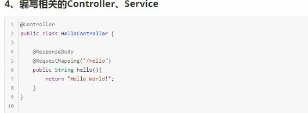


简化部署

导入插件


父项目


spring-boot-starter

springboot场景启动器帮我们导入了web模块正常运行所依赖的组件

springboot将所有的功能场景抽取出start

2 主程序类

@springbootApplication springboot应用标注在某各类上其是注解的组合


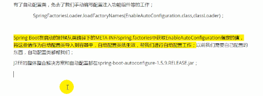

快速创建springboot


配置文件

springboot使用一个全局的配置文件,配置文件是固定的


application.properties

application.yml


yml语法

基本语法:

k:(空格)v : 表示一对键值对(空格必须有)

以空格的缩进来表示层级关系,只要是左对齐的一列数据都是同一级别的

属性和值是大小写敏感


将配置文件与bean对象一一对映


编写yaml文件

在bean上注解

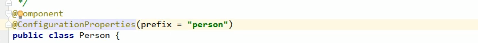

配置文件注入


用properties编写


configurationproperties和@value对比


@importResource导入spring的配置文件,让配置文件里面的内容生效

springboot里面没有spring的配置文件,我们自己编写的配置文件,也不能识别

想让springboot配置文件生效,加载进来@ImportResource.让其生效


springboot推荐的方式给容器添加组件的方式

1 配置类: @Configuration标注给容器中添加组件


配置文件占位符(yml和properties都支持)


​		1 以写随机数

​		2 占位符可以获取之前配置的值,如果没有可以用:指定默认值

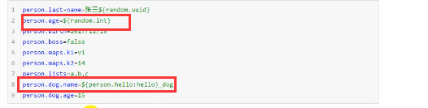

Profile

1 多profile文件

我们在编写文件的时候,文件名可以以 application-(profile).properties/yml

默认使用application.properties.


激活profile

1 我们用spring.properties.active=dev

yml文档块模式

​		

1 激活使用 spring.profile.active=dev

2  命令行方式激活

​		--spring-profile.active=dev


配置文件加载位置


springboot会从这四个位置全部加载配置文件,互补配置


外部配置


优先加载带profile无论是jar包外还是内,再来加载不带profile的


由jar包外向jar包内加载配置.

 

自动配置原理

springboot启动的时候就会架子啊主配置类 开启了自动配置功能

2 @EableAutoConfiguration作用


:smile:


##### 自动配置添加组件


细节

1 @Conditional扩展

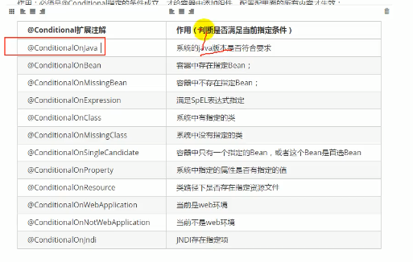

自动配置类在一定条件下才能生效


我们可以通过dubug=true属性,来让控制台打印自动配置报告,这样我们就可以很方便的知道那些自动配置类生效

### springboot与日志


以后开发的时候日志记录方法的调用,不应该来直接调用实现方法.


每一个日志的实现框架都有自己的框架配置文件,,使用都slf4j以后,配置文件还是做成日志实现框架的配置文件.

遗留问题.统一日志记录.

1 将系统中其他日志框架排除出去.

2 用中间包来替换原有的日志框架

3 我们导入slf4j其他的实现

springboot日志依赖关系


中间包


如果我们要引入其他框架,一定要把这个框架的默认日志包依赖除掉


logging指定配置


切换日志框架(不推荐)


web开发

使用springboot

1 创建springboot应用,选中我们需要的模块

2 springboot已经默认将这些场景配置好了,只需要在配置文件中配置少量配置就可以运行了

3 自己编写业务代码

自动配置原理

 这个场景,springboot帮我们实现了什么,能修改什么配置,能不能扩展

```
xxxAutoConfiguration 帮我们给容器中自动配置组件
xxxProperties: 配置类中封装配置文件的内容

```

springboot对静态资源映射的规则


通过webjars导入依赖

第二种导入自己的静态文件

2  "/**"访问当前项目的静态资源(静态资源路径)

```
"classPath:MATA-INF/resources",
"classpath :/resources/"
"classpath:/public/"
"/"当前项目根路径
```

localhost:8080/abc====去静态资源文件夹找abc

**欢迎页映射. 静态资源文件夹下所有的index.html页面,被"/**"映射**

**localhost:8080/     找index页面**

**4 所有的**/favicon.ico都是在静态资源文件下找**

###### 3 模板引擎


springboot推荐的Thymeleaf

语法更简单,功能更强大

1 引入thymeleaf


thymeleaf3适配layout2以上版本

Thymeleaf


Thymeleaf

导入thymeleaf的名称空间

```
<html lang="en" xmlns:th="http://www.thymeleaf.org">
```

语法


语法规则:

1 th:text 改变当前元素里面的文本内容

   1th:任意html属性; 来替换原来属性

属性优先级


表达式

${}   获取变量值


2 内置的工具对象


*{} 选择表达式 和${}功能一样,另外还有在${}获得对象后,获取属性名,配合th:object shiyong

#{}   取国际化内容,

@{} 定义url连接

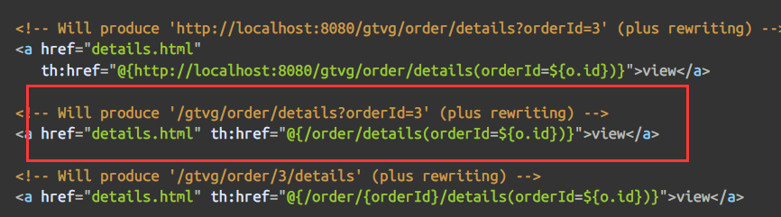


springboot 对springmvc的自动配置

组件的自动配置

5 如何修改springboot的默认配置

 模式:

1 springboot在自动配置很多组建的时候,先看容器中有没有用户自己配置的.

如果有用户配置的就先用用户的,如果没有就自己创建组件.


在类上添加@EnableWebMvc 表示springboot对springmvc的自动配置不需要了,所有都需要自己配置.

原理: 

4将WebMvcConfigurationSupport组件导入进来

5 导入的webMvcConfigurationSupport只是springmvc最基本的功能

2 在spingboot中有非常多的xxxconfiguration都是扩展的

crud

默认访问首页

默认访问首页的设置,需要导入thymeleaf和设置其版本号

首页静态资源需要放在trmplete模板下


国际化,配置国际化资源文件


2 springboot 自动配置号了管理国际化资源文件的组件

配置资源文件的位置


页面用th:text="#{}"取值

国际化定义一个按钮改变语言 实现localeresolver


登录与拦截器

登录拦截器


restful实现增删该查


thymeleaf 抽取公共片段

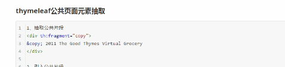


循环list

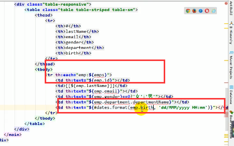


错误处理机制

默认效果,返回一个错误页面


如何定制json数据


没有自适应效果,浏览器客户端都返回json


配置嵌入式servlet容器


springboot默认使用tomcat作为嵌入式的seervlet容器


注册三大组件


springboot是以jar包方式启动嵌入式tomcat没有xml文件

注册三大组件有以下方式


注册filte


注册listener


springboot帮我们自动注册了dispachterServlet


使用starteer-web默认使用tomcat

嵌入式servlet容器自动配置原理


嵌入式servlet

优点: 简单,便携

缺点:默认不支持jsp,优化定制比较负载(使用定制器(Serverproperties,自定义enableedservletContainnerCustomer))自己编写嵌入式servlet容器的创建工厂

(enableedServletContainerFactor)

使用外部 的servlet容器,外面安装servlet


外部servlet启动原理

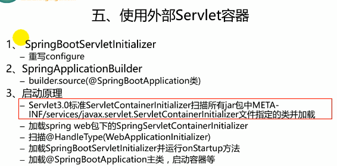

# docker


启动mysql


springboot数据交互


### druid

注册数据源

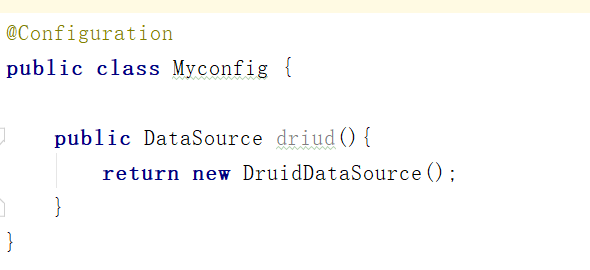

配置servlet


配置过滤器


### 整合mybatis(在springboot01项目里)

引入mybatis或创建的时候直接选中jdbc,mybatis,web三项即可


引入druid

配置文件:

```yml
spring:
  datasource:
    url: jdbc:mysql://172.20.10.4:3306/mybatis
    username: root
    password: 123456
    type: com.alibaba.druid.pool.DruidDataSource


    initialSize: 5
    minIdle: 5
    maxActive: 20
    maxWait: 60000
    timeBetweenEvictionRunsMillis: 60000
    minEvictableIdleTimeMillis: 300000
    validationQuery: SELECT 1 FROM DUAL
    testWhileIdle: true
    testOnBorrow: false
    testOnReturn: false
    poolPreparedStatements: true
    filters: stat,wall,log4j
    maxPoolPreparedStatementPerConnectionSize: 20
    useGlobalDataSourceStat: true
    connectionProperties: druid.stat.mergeSql=true;druid.stat.slowSqlMillis=500
    driver-class-name: com.mysql.jdbc.Driver


```

如果有错误导入log4j

```
<dependency>
            <groupId>log4j</groupId>
            <artifactId>log4j</artifactId>
            <version>1.2.17</version>
        </dependency>
```

servlet和filter

```java
package com.day01.springboot01.config;

import com.alibaba.druid.pool.DruidDataSource;
import com.alibaba.druid.support.http.StatViewServlet;
import com.alibaba.druid.support.http.WebStatFilter;
import org.springframework.boot.context.properties.ConfigurationProperties;
import org.springframework.boot.web.servlet.FilterRegistrationBean;
import org.springframework.boot.web.servlet.ServletRegistrationBean;
import org.springframework.context.annotation.Bean;
import org.springframework.context.annotation.Configuration;

import javax.sql.DataSource;
import java.util.Arrays;
import java.util.HashMap;
import java.util.Map;

@Configuration
public class DruidConfig {
    @ConfigurationProperties(prefix = "spring.datasource")
    @Bean
    public DataSource driud(){
        return new DruidDataSource();
    }
    @Bean
    public ServletRegistrationBean statViewServlet(){
        ServletRegistrationBean bean=new ServletRegistrationBean(new StatViewServlet(),"/druid/*");
        Map<String, String> map=new HashMap<>();
        map.put("loginUsername","admin");
        map.put("loginPassword","123456");
        map.put("allow","");
        bean.setInitParameters(map);
        return bean;
    }
    @Bean
    public FilterRegistrationBean webStatFilter(){
        FilterRegistrationBean bean = new FilterRegistrationBean(new WebStatFilter());
        Map<String,String> map=new HashMap<>();
        bean.setInitParameters(map);
        bean.setUrlPatterns(Arrays.asList("/*"));
        map.put("exclusions","*.js,*.css,/druid/*");

        return bean;
    }
}

```

创建表

```sql
SET FOREIGN_KEY_CHECKS=0;

-- ----------------------------
-- Table structure for `tab_dept`
-- ----------------------------
DROP TABLE IF EXISTS `tab_dept`;
CREATE TABLE `tab_dept` (
  `dept_id` int(11) NOT NULL AUTO_INCREMENT,
  `dept_name` varchar(255) NOT NULL,
  PRIMARY KEY (`dept_id`)
) ENGINE=InnoDB AUTO_INCREMENT=7 DEFAULT CHARSET=utf8;

-- ----------------------------
-- Records of tab_dept
-- ----------------------------
INSERT INTO `tab_dept` VALUES ('1', '开发部');
INSERT INTO `tab_dept` VALUES ('4', '测试部');
INSERT INTO `tab_dept` VALUES ('6', '管理部');

-- ----------------------------
-- Table structure for `tab_emp`
-- ----------------------------
DROP TABLE IF EXISTS `tab_emp`;
CREATE TABLE `tab_emp` (
  `emp_id` int(11) NOT NULL AUTO_INCREMENT,
  `emp_name` varchar(255) NOT NULL,
  `gender` tinyint(1) DEFAULT NULL,
  `email` varchar(255) DEFAULT NULL,
  `d_id` int(11) NOT NULL,
  PRIMARY KEY (`emp_id`),
  KEY `d_id` (`d_id`),
  CONSTRAINT `tab_emp_ibfk_1` FOREIGN KEY (`d_id`) REFERENCES `tab_dept` (`dept_id`)
) ENGINE=InnoDB AUTO_INCREMENT=1026 DEFAULT CHARSET=utf8;

-- ----------------------------
-- Records of tab_emp
-- ----------------------------
INSERT INTO `tab_emp` VALUES ('1', '小李', '1', '123@qq.com', '4');
INSERT INTO `tab_emp` VALUES ('2', '小马', '1', '456@qq.com', '1');
INSERT INTO `tab_emp` VALUES ('3', '小王', '1', '321@qq.com', '1');
INSERT INTO `tab_emp` VALUES ('4', '046100', '0', '046100@qq.com', '1');
INSERT INTO `tab_emp` VALUES ('5', 'babf61', '1', 'babf61@qq.com', '1');
INSERT INTO `tab_emp` VALUES ('6', '01fa12', '1', '01fa12@qq.com', '1');
INSERT INTO `tab_emp` VALUES ('7', 'f8f6d3', '1', 'f8f6d3@qq.com', '1');
```

使用mybatis逆向工程生成bean和mapper和dao层

引入mybatis-generator的核心依赖

```
<dependency>
            <groupId>org.mybatis.generator</groupId>
            <artifactId>mybatis-generator-core</artifactId>
            <version>1.3.5</version>
        </dependency>
```

生成generatorConfig.xml文件

```xml
<?xml version="1.0" encoding="UTF-8"?>
<!DOCTYPE generatorConfiguration
        PUBLIC "-//mybatis.org//DTD MyBatis Generator Configuration 1.0//EN"
        "http://mybatis.org/dtd/mybatis-generator-config_1_0.dtd">

<generatorConfiguration>

    <context id="DB2Tables" targetRuntime="MyBatis3">
        <commentGenerator>
            <property name="suppressAllComments" value="true"/>
        </commentGenerator>


        <jdbcConnection driverClass="com.mysql.jdbc.Driver"
                        connectionURL="jdbc:mysql://172.20.10.4:3306/mybatis"
                        userId="root"
                        password="123456">
        </jdbcConnection>

        <javaTypeResolver >
            <property name="forceBigDecimals" value="false" />
        </javaTypeResolver>
        <!--javabean  -->
        <javaModelGenerator targetPackage="com.day01.springboot01.bean" targetProject=".\src\main\java">
            <property name="enableSubPackages" value="true" />
            <property name="trimStrings" value="true" />
        </javaModelGenerator>

        <sqlMapGenerator targetPackage="mapper"  targetProject=".\src\main\resources">
            <property name="enableSubPackages" value="true" />
        </sqlMapGenerator>

        <javaClientGenerator type="XMLMAPPER" targetPackage="com.day01.springboot01.dao"  targetProject=".\src\main\java">
            <property name="enableSubPackages" value="true" />
        </javaClientGenerator>

        <table tableName="tab_emp" domainObjectName="Employee" ></table>
        <table tableName="tab_dept" domainObjectName="Department" ></table>

    </context>
</generatorConfiguration>
```

运行程序生成bean

```java
package com.day01.springboot01;import org.mybatis.generator.api.MyBatisGenerator;import org.mybatis.generator.config.Configuration;import org.mybatis.generator.config.xml.ConfigurationParser;import org.mybatis.generator.internal.DefaultShellCallback;import java.io.File;import java.util.ArrayList;import java.util.List;public class DataSourceTest {    
    public static void main(String[] args) throws Exception {        
        List<String> warnings = new ArrayList<String>();        
        boolean overwrite = true;        
        File configFile = new              File("E:\\IdeaProjects\\springboot01\\src\\main\\resources\\generatorConfig.xml");        ConfigurationParser cp = new ConfigurationParser(warnings);        
        Configuration config = cp.parseConfiguration(configFile);        		             DefaultShellCallback callback = new DefaultShellCallback(overwrite);        	     MyBatisGenerator myBatisGenerator = new 
            MyBatisGenerator(config, callback, warnings);        
        myBatisGenerator.generate(null);    
    }
}
```

mybatis注解版


自定义mybatis的配置规则


扫描所有mapper

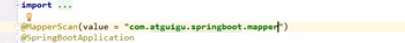

配置版mybatis

```
mybatis:
  config-location: classpath:mybatis/mybatis-config.xml
  mapper-locations: classpath:mybatis/mapper/*.xml
```

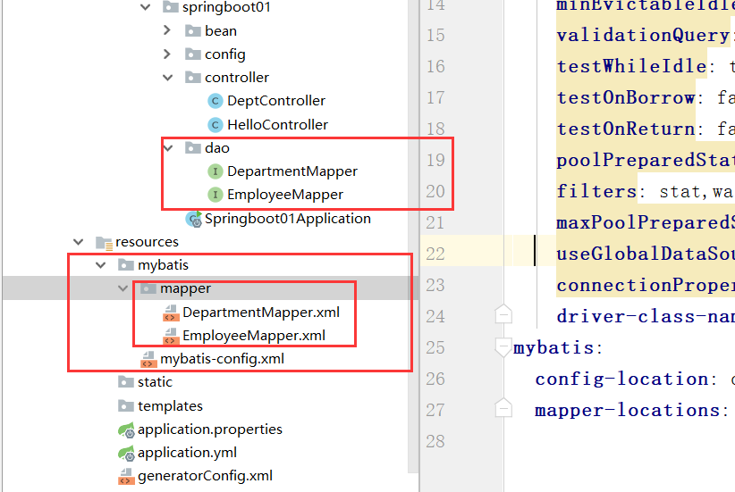

引入mybatis-config.xml文件

```xml
<?xml version="1.0" encoding="UTF-8" ?>
<!DOCTYPE configuration
        PUBLIC "-//mybatis.org//DTD Config 3.0//EN"
        "http://mybatis.org/dtd/mybatis-3-config.dtd">
<configuration>

</configuration>
```

整合springdata jpa

jap:orm(object relational Mapping)

1 编写一个实体类(bean)和数据表进行映射,并且配置好映射


application.yml文件

```yml
spring:
  jpa:
    hibernate:
      ddl-auto: update
    show-sql: true
  datasource:
    username: root
    url: jdbc:mysql://172.20.10.4:3306/jpa
    password: 123456
    driver-class-name: com.mysql.jdbc.Driver
```

springboot启动原理

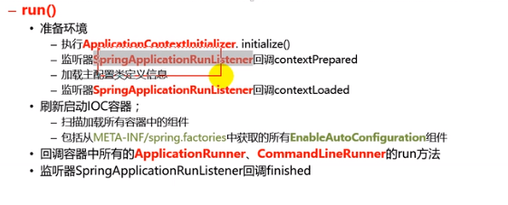

1 创建springapplication对象


2 

自定义starter

1 这个场景需要使用的依赖是什么

2 如何编写自动配置


springboot缓存


