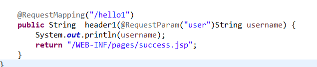

# springmvc


spring mvc流程:

导包:


写配置:

web-xml配置:

```xml

	<servlet>
		<servlet-name>springDispacherServlet</servlet-name>
		<servlet-class>org.springframework.web.servlet.DispatcherServlet</servlet-class>
		<init-param>
			<param-name>contextConfigLocation</param-name>
			<param-value>classpath:springmvc.xml</param-value>
		</init-param>
		<load-on-startup>1</load-on-startup>
	</servlet>
	
	<servlet-mapping>
		<servlet-name>springDispacherServlet</servlet-name>
		<url-pattern>/</url-pattern>
	</servlet-mapping>
```

在bean.xml配置包扫描

```
<context:component-scan base-package="com.day01.springcontroller"></context:component-scan>
```

创建控制器


并且有注解

```java

@org.springframework.stereotype.Controller
public class Controller {
	@RequestMapping("/helloworld")
	public String helloworld() {
		return "/WEB-INF/pages/success.jsp";
	}
}

```

运行流程:


### requestmapping

标在类上,指定基准路径

标在方法上,标注方法请求


method 限定请求方式:


value 请求方法

params 

标注携带请求参数


headers:

规定请求头

consumes:只接受内容类型是那种的请求,规定请求头中的content-type

produces: 告诉浏览器返回的内容类型,给响应头加上content-type

requestmaping的模糊匹配功能:

模糊匹配情况下,精确优先,


占位符: 路径上的占位符只能站一层路径


rest风格编程


通过不同的请求方式区分一个资源的增删改查


获取请求参数:





标注requestparam默认必须带参数


requestheader获取请求头信息


获取cookievalue


原生api


数据输出  :map model  ,modelmap都放在request域中


modelandview


sessionAttributes()


modelAttribute()标记字段,提示mvc不用new 对象直接只用我查出来的对象

解决字段覆写问题


源码


```java
protected void doDispatch(HttpServletRequest request, HttpServletResponse response) throws Exception {
		HttpServletRequest processedRequest = request;
		HandlerExecutionChain mappedHandler = null;
		boolean multipartRequestParsed = false;

		WebAsyncManager asyncManager = WebAsyncUtils.getAsyncManager(request);

		try {
			ModelAndView mv = null;
			Exception dispatchException = null;

			try {
				processedRequest = checkMultipart(request);
				multipartRequestParsed = (processedRequest != request);

				// Determine handler for the current request.
				mappedHandler = getHandler(processedRequest);
				if (mappedHandler == null || mappedHandler.getHandler() == null) {
					noHandlerFound(processedRequest, response);
					return;
				}

				// Determine handler adapter for the current request.
				HandlerAdapter ha = getHandlerAdapter(mappedHandler.getHandler());

				// Process last-modified header, if supported by the handler.
				String method = request.getMethod();
				boolean isGet = "GET".equals(method);
				if (isGet || "HEAD".equals(method)) {
					long lastModified = ha.getLastModified(request, mappedHandler.getHandler());
					if (logger.isDebugEnabled()) {
						logger.debug("Last-Modified value for [" + getRequestUri(request) + "] is: " + lastModified);
					}
					if (new ServletWebRequest(request, response).checkNotModified(lastModified) && isGet) {
						return;
					}
				}

				if (!mappedHandler.applyPreHandle(processedRequest, response)) {
					return;
				}

				// Actually invoke the handler.
				mv = ha.handle(processedRequest, response, mappedHandler.getHandler());

				if (asyncManager.isConcurrentHandlingStarted()) {
					return;
				}

				applyDefaultViewName(processedRequest, mv);
				mappedHandler.applyPostHandle(processedRequest, response, mv);
			}
			catch (Exception ex) {
				dispatchException = ex;
			}
			catch (Throwable err) {
				// As of 4.3, we're processing Errors thrown from handler methods as well,
				// making them available for @ExceptionHandler methods and other scenarios.
				dispatchException = new NestedServletException("Handler dispatch failed", err);
			}
			processDispatchResult(processedRequest, response, mappedHandler, mv, dispatchException);
		}
		catch (Exception ex) {
			triggerAfterCompletion(processedRequest, response, mappedHandler, ex);
		}
		catch (Throwable err) {
			triggerAfterCompletion(processedRequest, response, mappedHandler,
					new NestedServletException("Handler processing failed", err));
		}
		finally {
			if (asyncManager.isConcurrentHandlingStarted()) {
				// Instead of postHandle and afterCompletion
				if (mappedHandler != null) {
					mappedHandler.applyAfterConcurrentHandlingStarted(processedRequest, response);
				}
			}
			else {
				// Clean up any resources used by a multipart request.
				if (multipartRequestParsed) {
					cleanupMultipart(processedRequest);
				}
			}
		}
	}
```

九大组件


视图解析

forword转发不会拼串.


redirect


视图解析原理


自定义视图解析器

实现view的接口


默认静态资源访问设置


数据转换和数据格式化,数据校验

webdatabinder 数据绑定器,负责数据的校验和绑定,

conversionservice负责数据的格式化. validata负责数据的校验,bingingresukt负责数据校验和保存的错误.


自定义数据转换.

步骤:

conversionService 是一个接口

里面有converter(转换器)工作


第一步:实现converter接口

两个泛型,将什么转换成什么

2 converter 是conversionService 中的组件

​		2 将converter放进conversionService中

​		3 将webdatabinder 中的conversionService设置成我们这个加了自定义类型转换的的conversionServcie 

配置:

1 告用我们自己定义的诉springmvc别用自定义的,


2 让spring用conversionService


总结, 1 实现converter接口,2配置conversionService,3 rangspring用

### annotation-driven


没听懂

数据格式化

data数据默认为2019/12/12

只需要一个注解


注意,自定义类型转换器和默认类型转换器配置

以后写自定义类型转换器时,既有自定义类型转换器,还有格式化数据


数据校验

1 可以写程序让我们每一个数据进行校验 ,如果失败直接来到登录页面

2 spring mvc  提供jsr303 来做数据校验

jsr303 规范, hibernate validdator 规范

3 如何快速进行后端校验

导包


2 加注解

3 在springmvc 中告诉


4 如何知道校验结果

紧跟一个bindingresult


ajax请求

导包jason


文件下载


文件上传


多文件上传


拦截器

拦截器在目标运行之前或之后运行的东西


preHandle 拦截之前 在目标运行之前调用,返回boolean return true 放行,return false 不放行

postHandle 运行之后调用,目标方法运行之后

afterCompletion() 请求完成后,来到目标页面之后,chain.dofilter()放行

拦截器是一个接口

implement 

注册拦截器


只要放行afterCompletion都执行

多个拦截器


国际化


中英文切换


异常处理


集中处理异常需要加到ioc容器中


自定义异常


执行流程


spring-springmvc 整合

分工明确; springmvc配置文件和网站逻辑及网站功能有关

spring 配置文件来配置和业务有关的

### spring 发送put请求配置


只能用ajax直接发送put请求

