# ssh

## struts2

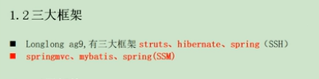


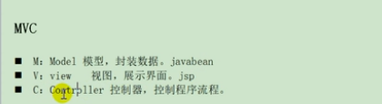

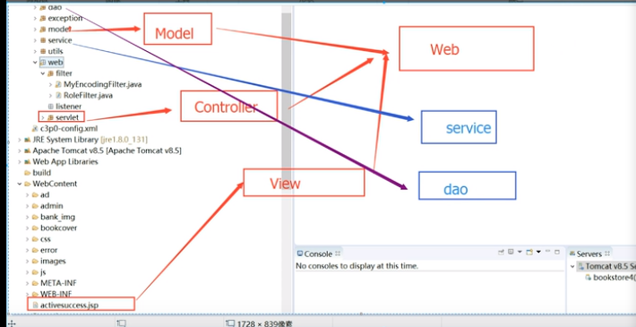

web层交表现层  mvc        struts2框架 属于表现层简化mvc结构 filter属于web层

service层 业务层

dao层数据访问层

执行顺序


tomcat启动会执行web.xml文件,xml文件有strutsfilter,会初始化过滤器,内部会加载struts.xml文件,浏览器访问,过滤器得到action,访问struts.xml,new一个action,然后调用对象的方法,然后返回结果并展示.

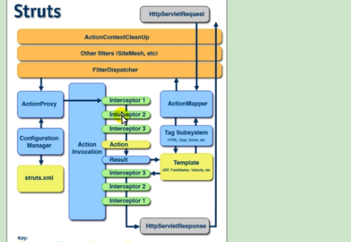

配置文件加载顺序:

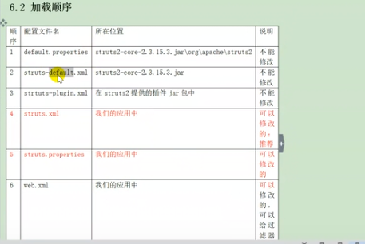

开发模式能够显示更多的错误信息

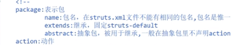

### package的属性: 

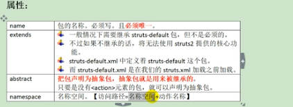

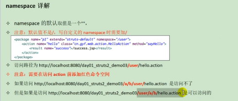

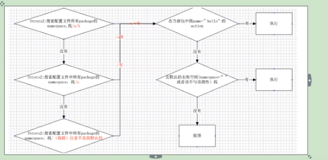

```
action:
			name: 动作名称,
			class: 动作类全名,
			method: 处理请求的的方法;
					1 默认是 public String excute(){
					}
					2 方法的要求:
						1 public
						2 返回值必须是String
						3 没有参数
```

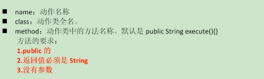

### action写法:

继承action的接口,struts.xml不需要写method,默认执行excute()方法,里面有常量可以用.

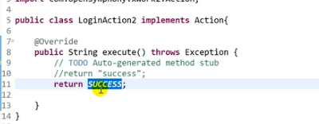

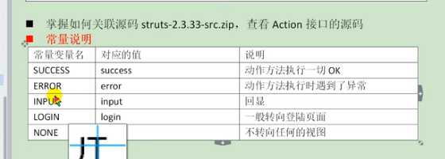

第三种:常用

第三种没有实现ecxute方法,找到父类的excute方法

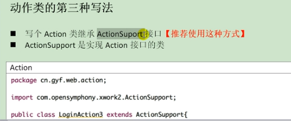

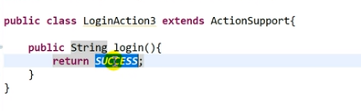

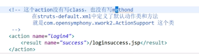

默认动作类:

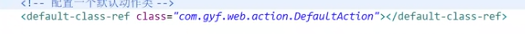

通配符 * 

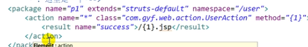

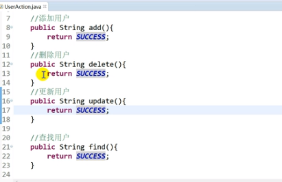

动态方法的调用:


### result元素:

​			name和type属性

​			name属性可以不写,默认是success

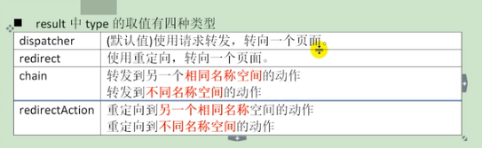

chain: 转发到另一个action中.

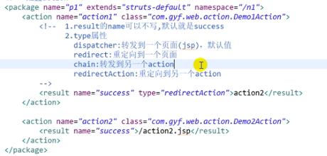

转发到不同包下的action,需要依赖注入,需要<param name="namespace">/另一个包的名称</param>

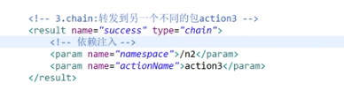

自定义结果类型

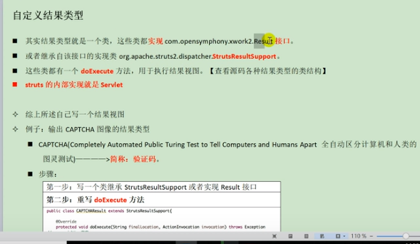

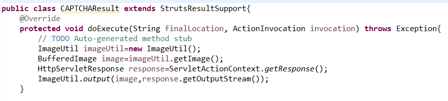

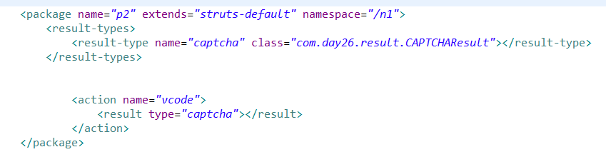

属性提供get set方法.在action写参数,会自动注入属性中.

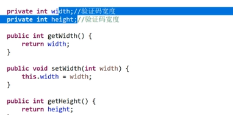

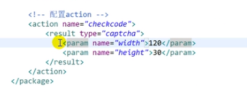

声名一个抽象包 并继承:

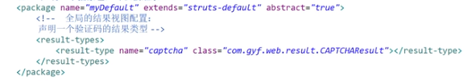


### action动作获取对象

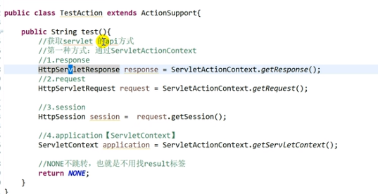

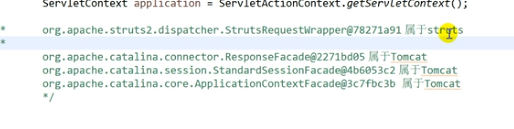

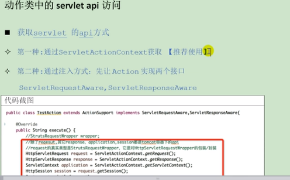

多个struts.xml配置文件

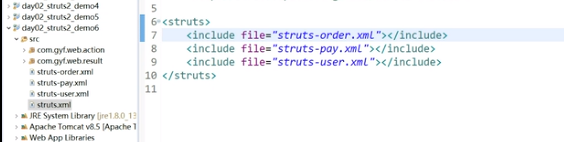

获取请求参数:1 通过request


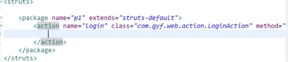


第二种::提供属性的set方法struts自动注入

第三种: 通过set模型:


第四种方式: (最常用)通过模型驱动,在action里实现一个模型驱动接口.通过这种方式就不用写user

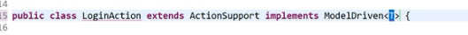

步骤: 

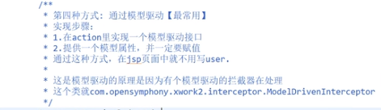

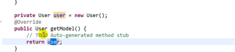

源码分析:

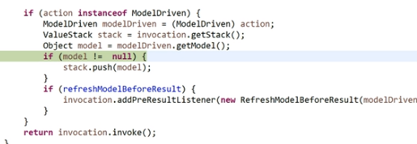

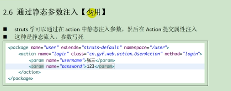

### 数据类型转换:

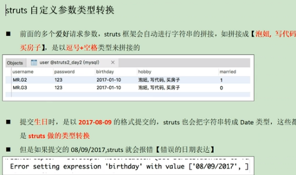

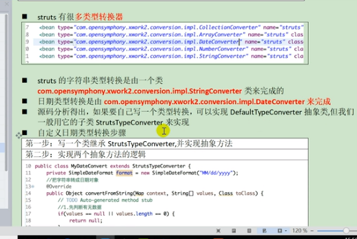

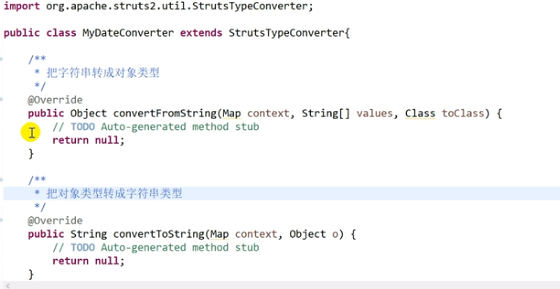


类名的地址:

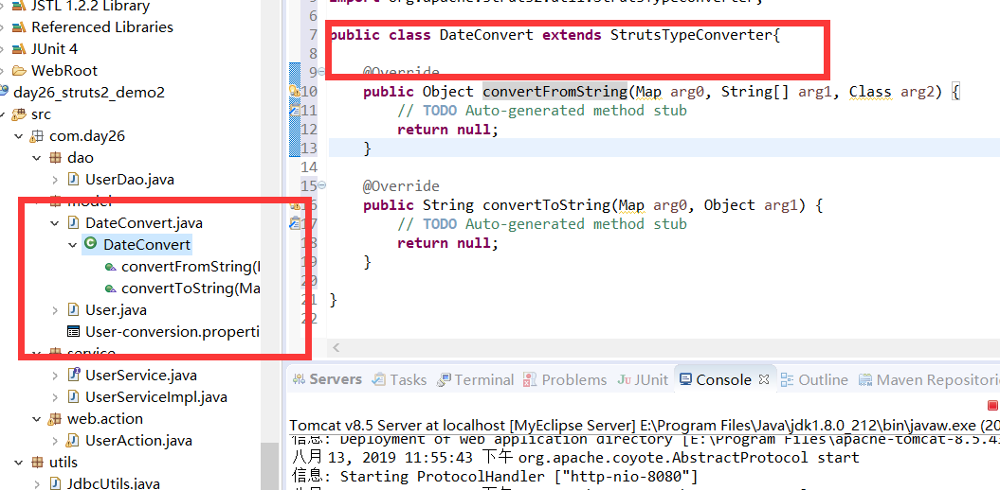

全局数据类型转换:

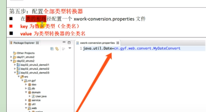

类的根路径指在src下.

### 回显

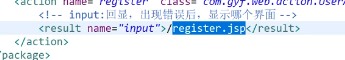

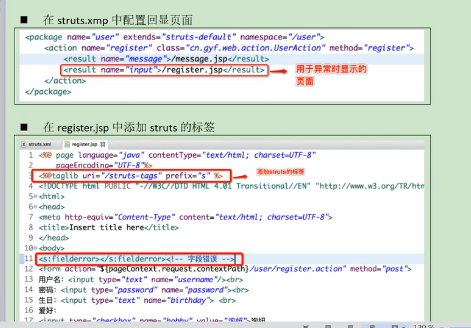

回显效果:

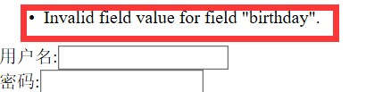

form表单

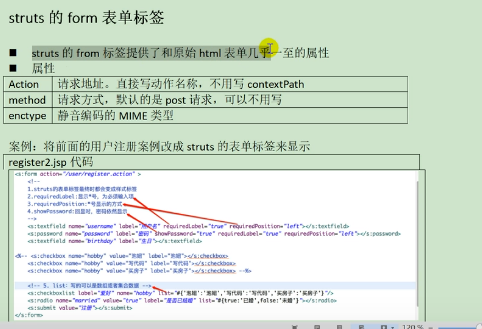

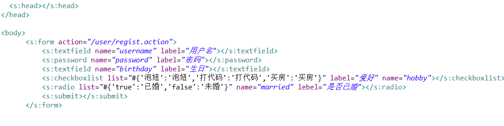

回显中文化

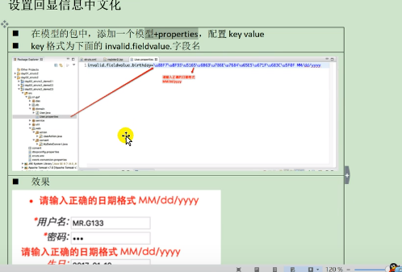


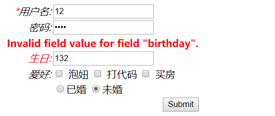

### 表单验证:

表单验证方式之重写validate方法:

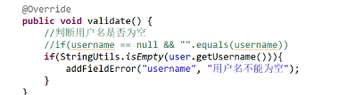

表单要用struts表单才能生效.


第二种写validateRgist()方法,只对regist有用.,

第三种在其他的方法上标注@skipvalidation注解.

在xml文件中全局声明:


在xml局部声名:


```
已定义的类型
conversion validator
date validator
double validator
email validator
expression validator   
fieldexpression validator
int validator max, min
regex validator
required validator
requiredstring validator 比required好一点,有去空格的作用.
short validator
stringlength validator maxLength minLength
url validator
visitor validator
```


### 国际化读取resource文件:


jsp获取国际化资源


struts读取国际化资源:顺序: 局部-包级别-全局


包范围的资源包:


### 拦截器的使用:

myintercepter需要继承AbstractIntercepter


xml文档声明


注:  在action配置了拦截器,则默认的拦截器就会失效.

登录拦截器


只对同一个包下的action有用.


文件上传:


中文显示


配置最大上传文件大小


多文件上传


文件下载


动态文件名


filename需要提供get方法

文件名中文显示


### ognl表达式


### contextmap


在contentmap存数据


取值


有多个属性相同时


通过索引取


不写<s:property>value的值,默认是栈顶的对象. 


setValue()如果栈里没有key会报错:

el表达式取值顺序


遍历


也可以用el表达式取

投影:


struts的符号


主题


避免表单重复提交


