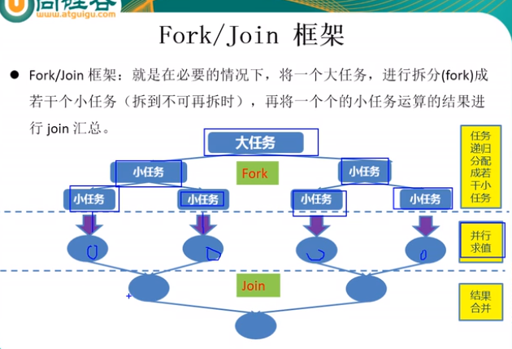
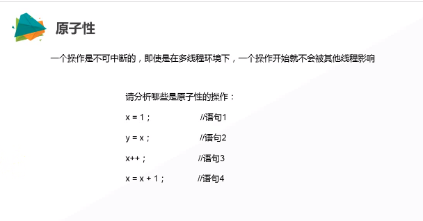

# 线程

### 实现线程的四种方法：

```java
//继承Thread类
...//代码实现
   package com.Thread;

public class Thread1 {

	public static void main(String[] args) {
		// TODO 自动生成的方法存根
		MyThread myThread = new MyThread();
		myThread.start();
		MyRunnable myRunnable = new MyRunnable();
		new Thread(myRunnable).start();
		for (int i = 1; i <= 200; i++) {
			System.out.println("main" + i);
		}
		System.out.println("end");
	}
}

class MyThread extends Thread {
	@Override
	public void run() {
		for (int i = 1; i <= 200; i++) {
			try {
				sleep(1000);
			} catch (InterruptedException e) {
				// TODO Auto-generated catch block
				e.printStackTrace();
			}
			System.out.println("MyThread" + i);
		}
	}
}

class MyRunnable implements Runnable {
	public void run() {
		for (int i = 1; i <= 200; i++) {
			System.out.println("MyRunnable" + i);
		}
	}
}
//实现Callable接口
//Callable有返回值,相较于实现runnerable有返回值,能抛出异常
class TestCallable implements Callable<Integer>{

    @Override
    public Integer call() throws Exception {
            int sum=0;
        for (int i = 0; i <=100 ; i++) {
            sum+=i;
        }
        return sum;
    }
}
//main
	TestCallable testCallable = new TestCallable();
     FutureTask<Integer> integerFutureTask = new FutureTask<>(testCallable);
        new Thread(integerFutureTask).start();
        try {
            Integer result = integerFutureTask.get();
            System.out.println(result);
        } catch (Exception e) {
            e.printStackTrace();
        }


```

### 定时器技术：

```java
package com.Thread;

import java.util.Timer;
import java.util.TimerTask;

class MyTimerTask extends TimerTask {
	public void run() {
		System.out.println("bomb");
	}
}

public class TraditinalTimerTest {
	public static void main(String[] args) {
		for (int x = 1; x <= 10; x++) {
			new Timer().schedule(new MyTimerTask(), 1000 + x * 100);
		}
		// TODO Auto-generated method stub
		// new Timer().schedule(new MyTimerTask(),1000);
		// new Timer().schedule(new MyTimerTask(),3000);
		/*
		 * while (true) { Date date= new Date(); System.out.println(date.getTime()); try
		 * { Thread.sleep(1000); } catch (InterruptedException e) { // TODO
		 * Auto-generated catch block e.printStackTrace(); }
		 */
		// }
	}
}

```

### 线程同步技术

```java
package com.Thread;

public class TraditionalThreadSynchronization {
	public static void main(String[] args) {
		new TraditionalThreadSynchronization().init();
	}

	public void init() {
		final outputer outputer = new outputer();
		// TODO Auto-generated method stub
		new Thread(new Runnable() {
			@Override
			public void run() {
				while (true) {
					try {
						Thread.sleep(10);
					} catch (InterruptedException e) {
						e.printStackTrace();
					}
					new outputer().output1("lixiaoling");
				}
			}
		}).start();
		new Thread(new Runnable() {
			@Override
			public void run() {
				while (true) {
					try {
						Thread.sleep(10);
					} catch (InterruptedException e) {
						// TODO Auto-generated catch block
						e.printStackTrace();
					}
					new outputer().output("wangxu");
				}
			}
		}).start();
	}

	/*
	 * class outputer{ public synchronized void output(String name) { int
	 * len=name.length(); //synchronized(this) {// for(int i=0;i<len;i++) {
	 * System.out.print(name.charAt(i)); } System.out.println(); } }
	 */
	// }
	static class outputer {
		public void output(String name) {
			synchronized (outputer.class) {
				int len = name.length();
				// synchronized(this) {//
				for (int i = 0; i < len; i++) {
					System.out.print(name.charAt(i));
				}
				System.out.println();
			}
		}

		public static synchronized void output1(String name) {
			int len = name.length();
			// synchronized(this) {//
			for (int i = 0; i < len; i++) {
				System.out.print(name.charAt(i));
			}
			System.out.println();
		}
		// }
	}
}


```

### 线程同步通信技术

例：子线程循环10次，主线程循环100，又回到子线程循环10次，有回到主线程100次，如此循环50。

```java
package com.Thread;
	
public class ExampleThread {
	public static void main(String[] args) {
		new ExampleThread().init();
	}

	public void init() {
		final bussize bussize = new bussize();
		new Thread(new Runnable() {
			@Override
			public synchronized void run() {
				for (int i = 1; i <= 50; i++) {
					bussize.sub();
				}
			}

		}).start();
		for (int i = 1; i <= 50; i++) {
			bussize.main();
		}
	}

}

class bussize {
	private boolean notice = true;

	public synchronized void sub() {
		if (!notice) {
			try {
				this.wait();
			} catch (InterruptedException e) {
				// TODO Auto-generated catch block
				e.printStackTrace();
			}
		}
		for (int j = 1; j <= 10; j++) {
			System.out.println("Threadson" + j);
		}
		notice = false;
		this.notify();
	}

	public synchronized void main() {
		if (notice) {
			try {
				this.wait();
			} catch (InterruptedException e) {
				// TODO Auto-generated catch block
				e.printStackTrace();
			}
		}
		for (int j = 1; j <= 100; j++) {
			System.out.println("Threadmain" + j);
		}
		notice = true;
		this.notify();
	}
}


		/*new Thread(new Runnable() {
			@Override
			public synchronized void run() {
				for(int i=1;i<=10;i++) {
					System.out.println("Threadson"+i);
				}

				new Thread(new Runnable() {	
					@Override
					public synchronized void run() {
						// TODO Auto-generated method stub
						for(int i=1;i<=100;i++) {
							System.out.println("Threadmain"+i);
						}
					}
				}).start();
			}
		}).start();*/
	/*public static void time() {
	Timer timer=new Timer();
	timer.start();
	for(int x=0;x<100;x++) {
		System.out.println(x);
	}
		timer.stop();
		System.out.println(timer.ONE_HOUR);
	}*/

```

### 线程的使用场景


同步方法处理继承的问题,


同步方法处理实现问题,监视器时this

同步方法处理继承(因为继承会有多个对象产生)的问题,监视器是此类本身

同步代码块处理实现,用this

同步代码块处理继承的问题,监视器是此类本身(.class)

线程死锁


避免死锁

lock解决线程安全问题

面试

synchronized与lock的异同:

相同:都能够解决线程安全问题

异同: synchronized机制在执行完相应的同步代码以后,自动的释放同步监视器

lock需要手动的启动lock(),同时结束时也需要手动的unlock()

```java
package com.day01.thread;

import java.util.concurrent.locks.ReentrantLock;

//解决线程安全问题lock
public class LockTest {
    public static void main(String[] args){
        Window window=new Window();
        new Thread(window).start();
        new Thread(window).start();
    }
}
class Window implements Runnable{
    private int ticket=100;
    private ReentrantLock lock=new ReentrantLock();
    @Override
    public void run() {
        try {
            lock.lock();
            while (true) {
                if (ticket > 0) {
                    System.out.println(Thread.currentThread().getName() + "-------" + ticket);
                    ticket--;
                } else {
                    System.out.println("no");
                    break;
                }
            }
        }finally {
            lock.unlock();
        }
    }
}
```

线程通信

wait() 线程阻塞,并会释放锁

​                sleep()是使线程阻塞,不会释放锁

notify 唤醒一个

notifyAll 唤醒所有被wait的线程

wait notify notifyAll三个方法必须使用在同步代码块或同步方法之中

这三个方法的调用者必须是同步代码块或同步方法之中的锁

面试

sleep() ,wait()的相同点,异同点

相同:使线程阻塞

不同:

1 其中sleep()是Thread的方法,wait是object的声名方法

2 调用的范围不同: sleep()是可以在任何需要的场景下调用, wait必须在同步代码块下掉用

3 关于是否释放同步监视器,如果两个方法都在同步代码块下,wait会释放锁,sleep()不会释放锁

### 生产者消费者

```java
package com.day01.test;
//生产者消费者问题,这种是不安全的
public class productTest {
    public static void main(String[] args) {
        Clerk clerk=new Clerk();
        Producer producer=new Producer(clerk);
        Consumer consumer=new Consumer(clerk);
        Thread pro = new Thread(producer);
        pro.setName("生产者");
        pro.start();
        Thread con = new Thread(consumer);
        con.setName("消费者");
        con.start();

    }

}
class Clerk{
    private int  currentproduct=0;
    public synchronized void prodcuceProduct() {
        if (currentproduct<20){
            currentproduct++;
            System.out.println(Thread.currentThread().getName()+"生产了第;"+currentproduct+"产品");
            notify();
        }else {
            try {
                wait();
            } catch (InterruptedException e) {
                e.printStackTrace();
            }
        }
    }

    public synchronized void consumerProduct() {
        if(currentproduct>0){
            System.out.println(Thread.currentThread().getName()+"消费了第;"+currentproduct+"产品");
            currentproduct--;
            notify();
        }else {
            try {
                wait();
            } catch (InterruptedException e) {
                e.printStackTrace();
            }
        }
    }
}
class Producer extends Thread{
    private Clerk clerk;
    public  Producer(Clerk clerk){
        this.clerk=clerk;
    }

    @Override
    public void run() {
        System.out.println(getName()+"开始生产产品");
        while (true){

            clerk.prodcuceProduct();
        }
    }
}
class  Consumer extends Thread{
    private Clerk clerk;
    public  Consumer(Clerk clerk){
        this.clerk=clerk;
    }

    @Override
    public void run() {
        System.out.println(getName()+"开始消费产品");
        while (true){
            clerk.consumerPrxoduct();
        }
    }
}
```

```java
//线程安全的生产者消费者
//消费者
class Consumer implements Runnable {
    private Clerk clerk;
    public  Consumer(Clerk clerk) {
        this.clerk = clerk;
    }
    @Override
    public  void run() {
        System.out.println("消费产品");
        while (true){
            clerk.sale();
        }
    }
}
//生产者
class Productor implements Runnable{
    private Clerk clerk;

    public  Productor(Clerk clerk) {
        this.clerk = clerk;
    }

    @Override
    public  void run() {
        System.out.println("生产产品");
        while (true){
            clerk.get();
        }
    }
}
//店员
class Clerk{
    private int product=0;
    public synchronized void get(){
        while(product>=10){
            System.out.println("买满了");
            try {
                this.wait();
            } catch (InterruptedException e) {
                e.printStackTrace();
            }
        }
            System.out.println("买一个产品,库存还有:"+ ++product);
            try {
                Thread.sleep(100);
            } catch (InterruptedException e) {
                e.printStackTrace();
            }
            this.notify();
    }
    public synchronized void sale(){
        while(product<=0){
            System.out.println("没货了");
            try {
                this.wait();
            } catch (InterruptedException e) {
                e.printStackTrace();
            }
        }
            System.out.println("卖一个产品,剩余"+product--+"个产品");
            try {
                Thread.sleep(100);
            } catch (InterruptedException e) {
                e.printStackTrace();
            }
            this.notify();
    }
}
```


### Condition控制线程通信

#### 			condition实现生产者消费者线程通信

```java
//消费者
class Consumer implements Runnable {
    private Clerk clerk;
    public  Consumer(Clerk clerk) {
        this.clerk = clerk;
    }
    @Override
    public  void run() {
        System.out.println("消费产品");
        while (true){
            clerk.sale();
        }
    }
}
//生产者
class Productor implements Runnable{
    private Clerk clerk;

    public  Productor(Clerk clerk) {
        this.clerk = clerk;
    }

    @Override
    public  void run() {
        System.out.println("生产产品");
        while (true){
            clerk.get();
        }
    }
}
//店员
class Clerk{
    private int product=0;
    private ReentrantLock lock=new ReentrantLock();
    private Condition condition=lock.newCondition();
    public  void get(){
        lock.lock();
        try {
            while (product >= 10) {
                System.out.println("买满了");
                try {
                    condition.await();
                } catch (InterruptedException e) {
                    e.printStackTrace();
                }
            }
            System.out.println("买一个产品,库存还有:" + ++product);
            condition.signalAll();
            try {
                Thread.sleep(100);
            } catch (InterruptedException e) {
                e.printStackTrace();
            }
        }finally {
            lock.unlock();
        }

    }

    public  void sale() {
        lock.lock();
        try {
            while (product <= 0) {
                System.out.println("没货了");
                try {
                    condition.await();
                } catch (InterruptedException e) {
                    e.printStackTrace();
                }
            }
            System.out.println("卖一个产品,剩余" + --product + "个产品");
            condition.signalAll();
            try {
                Thread.sleep(100);
            } catch (InterruptedException e) {
                e.printStackTrace();
            }
        }finally {
            lock.unlock();
        }
    }
}

```


新增创建线程的方法


实现callable接口

```java
package com.day01.threadNew;

import java.util.concurrent.Callable;
import java.util.concurrent.FutureTask;

public class ThreadNewTest {
    public static void main(String[] args) {
        try {
            FutureTask<Integer> futureTask = new FutureTask(new NumThread());
            new Thread(futureTask).start();
            System.out.println("-------------"+futureTask.get());
        } catch (Exception e) {
            e.printStackTrace();
        }
    }
}
class NumThread implements Callable<Integer>{

    @Override
    public Integer call() throws Exception {
        int sum=0;
        for (int i=1;i<=100;i++){
            if (i%2==0){
                sum+=i;
            }
        }
        return sum;
    }
}
```


如何理解callable接口比runnable强大

1 call()有返回值

2 call() 可以抛出异常,被外面的操作捕获,获取异常信息

3 callable是支持泛型的.

使用线程池


```java
package com.day01.threadpool;

import java.util.concurrent.ExecutorService;
import java.util.concurrent.Executors;

public class ThreadPoolTest {


    public static void main(String[] args) {
        ExecutorService service=Executors.newFixedThreadPool(10);
        service.execute(new NumberThread());
        service.shutdown();
    }
}
class  NumberThread implements Runnable{

    @Override
    public void run() {
        for (int i=0;i<100;i++){
            if (i%2==0){
                System.out.println(i);
            }
        }
    }
}

```

### 线程按需交替


```java
//main
AlterThread alterThread = new AlterThread();
        new Thread(new Runnable() {
            @Override
            public void run() {
                for (int i = 1; i < 20; i++) {
                    alterThread.loopA(i);
                }
            }
        },"A").start();
        new Thread(new Runnable() {
            @Override
            public void run() {
                for (int i = 1; i < 20; i++) {
                    alterThread.loopB(i);
                }
            }
        },"B").start();
        new Thread(new Runnable() {
            @Override
            public void run() {
                for (int i = 1; i < 20; i++) {
                    alterThread.loopC(i);
                    System.out.println("---------------------------");
                }
            }
        },"C").start();

class AlterThread{
    private int number=1;
    private Lock lock=new ReentrantLock();
    private Condition condition1=lock.newCondition();
    private Condition condition2=lock.newCondition();
    private Condition condition3=lock.newCondition();

    public void loopA(int loopNum){
        lock.lock();
        try {
            if (number != 1) {
                condition1.await();
            }
            for (int i = 1; i <=1 ; i++) {
                System.out.println(Thread.currentThread().getName()+"\t"+i+"\t"+loopNum);
            }
            number=2;
            condition2.signal();
        }catch (Exception e){
            e.printStackTrace();
        }finally {
            lock.unlock();
        }
    }

    public void loopB(int loopNum){
        lock.lock();
        try {
            if (number != 2) {
                condition2.await();
            }
            for (int i = 1; i <=1 ; i++) {
                System.out.println(Thread.currentThread().getName()+"\t"+i+"\t"+loopNum);
            }
            number=3;
            condition3.signal();
        }catch (Exception e){
            e.printStackTrace();
        }finally {
            lock.unlock();
        }
    }
    public void loopC(int loopNum){
        lock.lock();
        try {
            if (number != 3) {
                condition3.await();
            }
            for (int i = 1; i <=1 ; i++) {
                System.out.println(Thread.currentThread().getName()+"\t"+i+"\t"+loopNum);
            }
            number=1;
            condition1.signal();
        }catch (Exception e){
            e.printStackTrace();
        }finally {
            lock.unlock();
        }
    }
}
```

### ReadWriteLock读写锁


```java
class TestReadWriteLock{
    public static void main(String[] args) {
        TestReadWriteLock readWriteLock=new TestReadWriteLock();
        new Thread(new Runnable() {
            @Override
            public void run() {
                readWriteLock.set((int)(Math.random()*101));
            }
        },"write").start();
        for (int i = 0; i < 100; i++) {
            new Thread(new Runnable() {
                @Override
                public void run() {
                    readWriteLock.get();
                }
            }).start();
        }
    }
    private int number;
    private ReadWriteLock lock=new ReentrantReadWriteLock();
    public void get(){
        lock.readLock().lock();
        try {
            System.out.println(Thread.currentThread().getName()+" : "+number);
        }finally {
            lock.readLock().unlock();
        }
    }
    public void set(int number){
        lock.writeLock().lock();
        try{
            System.out.println("write");
            this.number=number;
        }finally {
            lock.writeLock().unlock();
        }
    }
}
```

### 线程8锁


1 某一时刻,只能一个线程拿到锁,其他线程需等待,无论多少个方法,

2 非静态方法的默认为this,静态方法的锁对应为Class实例

### 线程池


```java
//线程池的体系结构,java.util.Executor,负责线程的使用与调度的跟接口,

//ExecutorService 子接口,线程池的主要接口,
//实现类 ThreadPoolExecutor 
//ScheduledExecutorService   子接口,负责线程的调度
//---ScheduledThreadPoolExecutor : 继承了ThreadPoolExecutor 实现了ScheduledExecutorService   
class ThreadPool{
    public static void main(String[] args){
        ExecutorService pool=Executors.newFixedThreadPool(5);
        pool.submit(new Thread(new Runnable(){
            public void run(){
                for(int i=0;i<=100;i++){
                    if(i%2==0){
                        System.out.println(i);
                    }
                }
            }
        }));
        pool.shutdown();
    }

}
```


```java
class ThreadPoolExecutor{

        public static void main(String[] args) throws Exception {
            ScheduledExecutorService pool=Executors.newScheduledThreadPool(5);
            for (int i = 0; i <5; i++) {
                Future<Integer> result=pool.schedule(new Callable<Integer>(){
                    @Override
                    public Integer call() throws Exception {
                        int num=new Random().nextInt(100);
                        System.out.println(Thread.currentThread().getName()+" : "+num);
                        return num;
                    }
                },3,TimeUnit.SECONDS);
                System.out.println(result.get());
            }

            pool.shutdown();
        }


    }
```




有序性


可见性

]




volatile防止重拍,具有可见性和有序性


原子变量只能在竞争不激烈的条件下使用

只有下保证原子性的条件下才能使用Valatile

监视器锁:性能方面强

显示锁: 功能方面强大,可以退出锁,可以自行释放锁

源自变量:非阻塞是,自旋锁,循环里面不断修改变量值,性能好,原子变量只能在竞争不激烈的条件下使用


