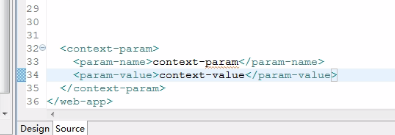
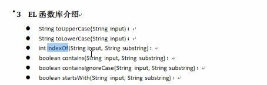
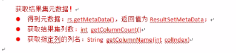
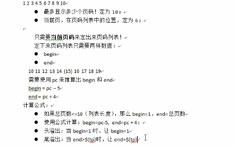
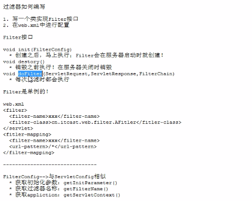
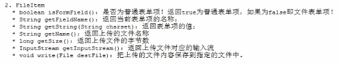
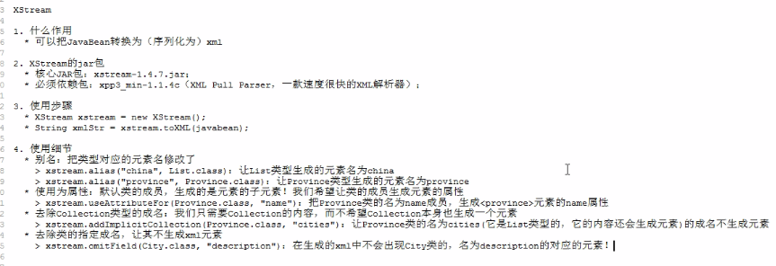

# css

一般情况下，css后加载的优先级高

## 选择器

### 1.基本选择器：

1.标签选择器：

```css
	<style>
div{
    background-color:red
}
p{
    ...
}
</style>
<div>hello</div>
<p>hhhh</p>
```

2.类选择器：

```css
<style>
	.div1{
	...
	}
</style>
<div class="div1">ha</div>
<div class="div1">ha</div>
```

3.id选择器：

```css
<style>
	#div1{
	...
	}
</style>
<div id="div1">ha</div>
```

基本选择器的优先级：style>id选择器>class选择器>标签选择器。

### 2.扩展选择器

1.关联选择器

```css
<style>
	div p{
	...
	}
</style>
<div><p>ha</p></div>
```

2.组合选择器

```css
<style>
	div,p{
	...
	}
</style>
<div>ha</div>
<p>ha</p>
```

3.伪类选择器

```css
//原始状态 :link
//悬停状态 :hover
//点击     :active
//点击后   :visited
//记忆： lv ha
<style>
	a:link{
	...
	}
	a:hover{
    ...
	}
</style>
<a href=".."></a>
```

## 盒子

### 1.边框和布局


```css
<head>
	<style type="text/css">
			div{
				height: 200px;
				width: 300px;
				border: 2px solid chartreuse;
			}
			#div1{
				padding: 20px;
				margin-left:50%
			}
			#body{
				height: 100%;
				width: 100%;
				border: 2px solid darkgoldenrod;
			}
	</style>
</head>
<body>
	<div id="body">
		<div id="div1">hh</div>
		<div id="div2">hh</div>
		<div id="div3">hh</div>
	</div>
</body>
```

### 2.漂浮和位置

```
float:left/right
设置之后下面的文本流向右或左。
position:absolute/relative
absolute将对象拖出文本流，飘在文本之上，可以用top,left改变位置
relative不会脱出文档流，可以用top,left...定位

```

# javascript

### 1.js 的dom对象

1.document 

2.属性对象

3.文本对象

4.node节点对象，是其父对象。在对象里边找不到方法，在父节点找方法。


### document对象常用方法：

```
.write()//向页面输出html代码或变量（值）
.getElementById();//通过id得到元素（标签）
.getElementsByName();//得到集合
.getElementsBytag();
```


### element对象：

```
.getAttribute();//得到属性的值
.setAttribute();//设置属性和值
.renoveAttribute();//删除属性，不能删除value
.childNodes();//兼容性差
.getElementsByTagName();//返回数组//获取所有子标签的唯一方法
```

### Node对象属性：

```
标签节点对应的值
nodeName:1
nodeType:大写的标签名称
nodeValue：null
属性节点对应的值
nodeName:属性名称
nodeType:2
nodeValue：属性的值
文本节点对应的值
nodeName:#text
nodeType:3
nodeValue：//文本内容

parentNode
childNodes
firstChild
lastChild
nextSibling
previousSibling
```


### 操作dom树

```
appendChild//添加子节点到末尾，相当于剪贴的作用。
removeChild
replaceChild(newNode,oldNode)
cloneNode(boolean)//复制节点true指复制其子节点
insertBefore(newNode,oldNode)//1.创建标签 2，创建文本 3，添加文本到标签下。

```

```html
<!DOCTYPE html>
<html>
	<head>
		<meta charset="utf-8">
		<title></title>
	</head>
	<body>
		<ul id="ul1">
			<li>hello</li>
			<li id="li2">world</li>
			<li>beautiful</li>
		</ul>
		<input type="button"  value="insert" onclick="insert1()" />
		<script type="text/javascript">
			function insert1(){
				var li2=document.getElementById("li2");
				var li4=document.createElement("li");
				var text=document.createTextNode("牛皮");
				li4.appendChild(text);
				var ul=document.getElementById("ul1");
				ul.insertBefore(li4,li2);
				
			}
		</script>
	</body>
</html>

```


```
例：生成table
```

```html
<!DOCTYPE html>
<html>
	<head>
		<meta charset="utf-8">
		<title></title>
	</head>
	<body>
		行：<input type="text"  id="h" />
		列：<input type="text"  id="l" />
<input type="button" value="table" onclick="insert()"/>
		<div id="div1">	
		</div>
		<script type="text/javascript">
			function insert(){
			var h=document.getElementById("h").value;
			var l=document.getElementById("l").value;
	var table="<table border='1px' bordercolor='red'>";
				for(var i=1;i<=h;i++){
					table+="<tr>";
					for(var j=1;j<=l;j++){
						table+="<td>aaaaaaa</td>"
					}
					table+="</tr>"
				}
				table+="</table>";
			var div1=document.getElementById("div1");
				div1.innerHTML=table;
			}
		</script>
	</body>
</html>

```

```
例，cloneNode方法
```

```html
<!DOCTYPE html>
<html>
	<head>
		<meta charset="utf-8">
		<title></title>
	</head>
	<body>
		<ul id="ul1">
			<li>java</li>
			<li>c</li>
			<li>c++</li>
		</ul>
		<div id="div1">	
		</div>
		<input type="button"  onclick="copy()" value="copy" />
		<script type="text/javascript">
			function copy(){
			var ul1=document.getElementById("ul1");
			var div1=document.getElementById("div1");
			var ulcopy=ul1.cloneNode(true);
			div1.appendChild(ulcopy);
			}
		</script>
	</body>
</html>

```

### 总结

```html
获取节点：
	getElementById();
	getElementByName();
	getElementsByTagName();
插入节点：
	insertBefore(newNode,oldNode)；
	appendChind()
删除节点：
	removeChild() //通过父节点删除
替换节点：
	replaceChild() //通过父节点替换
```

### innerHTML属性

```
	其不是dom组成部分，大部分浏览器都支持。获取文本内容，向标签里边设置内容（可以写html代码）
```

```
例1：动态显示时间
```

```html
<!DOCTYPE html>
<html>
	<head>
		<meta charset="utf-8">
		<title></title>
	</head>
	<body>		
		<div id="div1">	
		</div>
		<script type="text/javascript">
		function gett(){
				var date=new Date();
				var date=date.toLocaleString();
			var div1=document.getElementById("div1");
			//每一秒写一个时间
				div1.innerHTML=date;
			}
			setInterval("gett();",1000);
		</script>
	</body>
</html>
```

```
例2：省市联动
```

```html
<!DOCTYPE html>
<html>
	<head>
		<meta charset="utf-8">
		<title></title>
	</head>
	<body>
	<select id="contry" onchange="add1(this.value);">
			<option value="0">请选择</option>
			<option value="湖北">湖北</option>
			<option value="陕西">陕西</option>
			<option value="河南">河南</option>
	</select>
	<select id="city">
	</select>
	<script type="text/javascript">
		var arr=[
			["湖北","武汉","宜昌","仙桃","孝感"],
			["陕西","商洛","西安","榆林","宝鸡"],
			["河南","开封","洛阳","郑州","安阳"]
			];
			
		function add1(val){
			var city =document.getElementById("city");
			city.options.length=0;
				  /*var option2=city.getElementsByTagName("option");
					for(var m=0;m<option2.length;m++){
						var op = optin2[m];
						city.removeChild(op);
							m--;
						}*/
			for(var i=0;i<=arr.length;i++){
				var arr1=arr[i];
				var firstvalue=arr1[0];
				if(firstvalue == val){
					for(var j=1;j<arr1.length;j++){
						var value1=arr1[j];
		var option1=document.createElement("option");
			var text=document.createTextNode(value1);
							option1.appendChild(text);
							city.appendChild(option1);
						}	
					}
				}
			}
		</script>
	</body>
</html>

```

### xml

1 xml 可扩展标记型语言，它的标签可以自己定义，可以写中文的标签。

html是用于显示数据，xml主要功能，为了存储数据。是wsc组织发布的技术。

版本为1.0和1.1，其中1.1的版本不能向下兼容。

2 xml的应用：

```
1 不同的系统之间传输数据
2 用来表示生活中有关系的数据
3 经常用在配置文件
```

```
1 xml的文档声明
2 定义元素
3 注释
4 特殊字符
5 cdate
6 pi指令
```

1 xml的文档声明

```
<?xml version="1.0" encoding="utf-8"?>
<person>
    <name>hello</name>
    <age>20</age>
</persion>
```

```xml-dtd
xml属性的定义：
    一个标签可以有多个属性
    属性名称不能相同
    属性名称和属性值之间用= 属性值用引号包起来，
    xml属性的名称规范和元素的名称规范一致。
xml的注释：
<!--<persion></persion>-->
注意，注释并不能嵌套。也不能放到第一行，第一行第一列放文档注释。
xml的特殊字符：
	< 	&lt;
	>	&gt;
xml的cdate：
	可以解决多个字符都需要转义的操作，把这些内容放到cdate里面，不需要转义。
	写法 ：<![CDATA[ 内容 ]]>
	把特殊字符当作文本内容。
PI指令（处理指令）：
	可以在xml设置样式。
	<?xml-stylesheet type="text/css" href="css路径"?>
xml的约束的技术：
	1 dtd约束
	2 schema约束
dtd入门：
	1 创建一个文件后缀.dtd文件
	步骤：
    	1 查看xml多少个元素，创建<!ELEMENT>
    	2 判断元素是简单元素还是复杂元素。
    		复杂元素：<!ELEMENT 元素名称(子元素)>
    		简单元素：<!ELEMENT 元素名称(#PCDATA)>
    	3 需要在xml文件引入dtd文件
    		<!DOCTYPE 根元素名称 SYSTEM "dtd文件的路径">
    	打开xml使用浏览器，浏览器只负责校验语法，不负责校验约束。
    	如果想要校验约束，需要工具<myeclipse>
       引入方式：
			1 外部 <!DOCYTPE 根元素名称 SYSTEM "dtd路径">
			2 使用内部的dtd文件
				<!DOCTYPE person [
					<!ElEMENT person (name,age)>
					<!ElEMENT name (#PCDATA)>
					<!ElEMENT age (#PCDATA)>
					]>
			3 使用外部的dtd文件（网络上的dtd文件）
			<!DOCTYPE 根元素 PUBLIC "dtd名称" “dtd文档的url”>
					struts2使用配置文件。使用外部的dtd文件
dtd定义元素：
语法：<!ELEMENT 元素名 约束>
		<!ELEMENT name(#PCDATA)>//(#PCDATA)表示字符串类型
						EMPTY元素为空
						ANY 任意
复杂元素：
		<!ELEMENT person (name+,age?,sex*,birthday)>
	1 表示子元素出现的次数：
		+ ：表示一次或多次
		? :出现0次或一次
		* :表示0次或多次
	2 子元素之间用,隔开，表示子元素出现的顺序。
	3 之间用|隔开，表示元素只能出现其中一个
	
使用dtd定义属性：
	语法： <!ATTLIST 元素名称
    	属性名称 属性类型 属性的约束
    >	
属性的类型：
	1 CDATA :字符串
			<!ATTLIST birthday
				ID1 CDATA  #REQUIRED
			>
			<birthday ID1="aaa">2015</birthday>
	2 枚举： 表示只能在一定范围内出现值，但是只能每次出现其中一个。
				<!ATTLIST age
				ID2 (AA|BB|CC) #REQUIRED
				>
				<age ID2="AA">20</age>
	3 ID :值只能是字母或者下划线开始
				<!ATTLIST name
					ID3 ID #REQUIRED
				>
				<name ID3="java">hello</name>
				<name ID3="hello">java</name>
属性的约束：
		1 #REQUIRED//属性必须存在
		2 #IMPLIED//属性可有可无
		3 #FIXED//表示一个固定值
		4 直接值： 不写属性，使用直接值
					写了属性。使用设置那个值
			<!ATTLIST school
				ID5 CDATA "shool"
			>
实体定义：<!ENTITY 实体名称 "实体的值">
		实体需要写在内部dtd里面。
		引用： &实体名称;
            <!ENTITY test "hello java">
            <name ID3="java">&test;</name>
xml解析：
	xml标记型文档
	js dom解析
	html 分配树形结构，将标签，属性和文本分装成对象
	xml的解析方式：dom和sax
		使用dom解析，容易内存溢出。优点，方便实现增删改操作
		使用sax不会造成内存溢出，实现查询，使用sax方式，不能实现增删改操作
jaxp的操作：
	jaxp是java se的一部分。
	jaxp解析器在javax.xml.parsers包里面
		四个类：
			dom: DocumentBuilder
		可以从DocumentBuilderFactory.newDocumentBuilder()获得
				DocumentBuilderFactory
			sax: SAXParsers
				SAXParsersFactory
使用jasp
		NodeList list=document.getElementsByTagName("name");
			for(int i=0;i<list.getLength();i++){
				String string=list.item(i).getTextContent();
				System.out.println(string);
			}
schema约束：
	一个xml中可以有多个schema，多个schema使用名称空间区分.(类似于Java包)
	schema快速入门：
		创建schema文件。
		1 看元素：
		2 在schema文件里面：
				xmlns="http://www.w3.org/2001/XMLSchema"
				targetNamespace="http://www.itcast.org/1" 
				elementFormDefault="qualified">
创建<element></element>
<person xmlns:xsi="http://www.w3.org/2001/XMLSchema-	instance"//表示被约束的文档
xmlns="http://www.example.org/1" //约束文档的tagetNamespace
xsi:schemaLocation="http://www.example.org/1 1.xsd">//tagetNamespace 空格 约束文档的地址路径。
<squence>表示元素出现的顺序
<all>表示元素只出现一次
<choice>出现其中一个
maxoccurs="unbounded"//表示元素出现的个数
属性定义：写在复杂元素里面
<attribute name="id1"//属性名称 type="int"//类型 use="required"//属性是否必须出现></attribute>
复杂的schema约束：
	引入多个schema则给每个起别名，用 <dept:name>122</dept:name>引用。


2 sax解析的原理
		解析xml有dom和sax
			其中sax采用事件驱动，边读边解析。
                    SAXParser
                    SAXParserFactory 
    1 SAXParser通过SAXParserFactory.newSAXParser()方法获得。

	.parse(File f, DefaultHandler dh) //两个参数,第二个参数是事件处理器.
	DefaultHandler有几个方法如下：

		1 startElement(String uri, String localName, String qName//把标签的名称返回, Attributes attributes) //自动调用
	
		2 characters(char[] ch, int start, int length)//自动执行文本 作用：返回文本内容

		3 endElement(String uri, String localName, String qName//返回标签名称) //结束标签
		当解析到开始标签的时候，执行startElement方法，参数qName,返回标签名称，解析到文本执行characters()方法，返回文本内容，当解析到标签结束的时候，自动执行endElement方法。
使用dom4j解析xml
	dom4j不是javase的部分，导入dom4j的jar包。
		SAXReader saxReader = new SAXReader();
		Document document=saxReader.read("src/hello.xml");
		Element root=document.getRootElement();//得到element
	document有如下方法：
			查询：
			getRootElement()//获取根节点，返回element
			getParent();
			addElement();
		得到根节点后得到子标签
			element(qName);//获取其下第一个子标签，
			elements(qName)://获取其下所有子标签，返回list
			elements()//获取其下一层子标签。
			.getText()//得到值。
			添加：
		在添加的标签下面addElement("标签名称");得到Element ，然后添加文本，.setText("文本内容")，然后回写，new XMLWriter(new FileoutputStream("路径"),OutputFormat.createPrettyPrint()//第二个参数格式化回写文本);之后.Writer(document);关闭xmlWriter流。
			特定位置添加元素：
//获取p1下的所有标签，DocumentHelper.createElement("school")创建元素，添加文本，调用list.add(1,school)写入文档位置，之后回写。
		List<Element> list=p1.elements();
	Element school=DocumentHelper.createElement("school");
			school.setText("scuec");
			list.add(1,school);
	OutputFormat format=OutputFormat.createPrettyPrint();
	XMLWriter writer= new XMLWriter(new FileOutputStream("src/hello.xml"),format);
			writer.write(document);
			writer.close();
使用dom4j实现修改节点的操作；
	school.setText("scuec");
	先setText然后回写。
使用dom4j实现删除节点的操作；
		父节点.remove(子节点)；
		回写
使用dom4j实现获取属性的操作；
		p1.attributeValue("id1")
12 使用dom4j支持xpath
		1 /AAA/DD/BBB 表示aaa下的dd下的bbb元素
		2 //aaa 选择所有的aaa元素
		3 //aaa/bbb 所有的aaa下的所有bbb元素
		4 /* 表示所有
		5 bbb[1] 表示bbb第一个元素
		6 bbb[@id] 只要bbb上有id属性，都能得到
		7 bbb[@id='b1'] 元素是bbb，上有id属性，并且属性的值为b1

```

### java泛型

将字符串类型放入到集合里面，这个值放进去后，失去本身的类型。

​		在集合上如何使用泛型，常用集合, list set map 泛型语法，

```java
集合<String>  如List<String>
```

泛型擦除//泛型只出现源代码中,编译后就不存在.


在list使用泛型。

```java
package com.day02.test;
import java.util.ArrayList;
import java.util.Iterator;
import java.util.List;
import org.junit.Test;
public class TestDemo2 {
	// 泛型在集合上使用
	@Test
	public void testdemo1() {
		List<String> list = new ArrayList<String>();
		list.add("aaa");
		list.add("bbb");
		// 普通for循环 for增强 迭代器
		/*
		 * for (int i = 0; i < array.length; i++) {
		 * System.out.println(list.get(i)); }
		 */
		// 增强for循环
		/*
		 * for (String string : list) { System.out.println(string); }
		 */
		// 迭代器
		Iterator<String> iterator = list.iterator();
		while (iterator.hasNext()) {
			System.out.println(iterator.next());
		}

	}

}

```

set集合使用泛型：

```java
@Test
	public void testset() {
		Set<String> set=new HashSet<String>();//无重 无序
		set.add("aad");
		set.add("dsdffds");
		//增强for
		//迭代器
		/*for (String string : set) {
			System.out.println(string);
		}*/
		Iterator<String> iterator=set.iterator();
		while (iterator.hasNext()) {
			System.out.println(iterator.next());	
        }	
	}
```

map集合使用泛型：

```java
@Test
	public void testMap() {
		Map<String,Integer> map=new HashMap<String, Integer>();
		map.put("aaa", 3242);
		map.put("dssdsd", 2423423);
		map.put("java", 3456);
		//循环取出
		//通过获取key得到value
		//通过key value的关系
/*		Set<String> set= map.keySet();
		for (String key : set) {
			System.out.println(key+":"+map.get(key));
			
		}*/
		Set<Entry<String, Integer>> set= map.entrySet();
		for (Entry<String, Integer> entry : set) {//entry是key和value的关系
			System.out.println(entry.getKey()+":"+entry.getValue());
		}
	}
```

方法中使用泛型:

```java
package com.day03.test;

import java.util.Arrays;

public class TestDemo1 {

	public static void main(String[] args) {
		// TODO Auto-generated method stub
		Integer[] arrary = { 1, 2, 3, 445 };
		swap(arrary, 2, 3);
		String[] aStrings = { "dad", "dada", "java", "c++" };
		swap(aStrings, 2, 3);
		System.out.println(Arrays.toString(aStrings));

	}

	/*
	 * public static void swap(int[] arr, int x, int y) { int temp=arr[x];
	 * arr[x]=arr[y]; arr[y]=temp; }
	 */
	// 使用泛型方法：
	public static <T> void swap(T[] arr, int x, int y) {
		T temp = arr[x];
		arr[x] = arr[y];
		arr[y] = temp;
	}

}

```

### 枚举

需要在一定的范围内取值，这个值只能在这个范围内中的任意一个。使用关键字enum。其构造方法私有。

​		交通信号灯为例

```java
特殊枚舉：
	package com.day03.meiju;

public class Test {
}
enum color{
	RED("red"){

		@Override
		public void print() {
			// TODO Auto-generated method stub
			System.out.println("red");
		}
		
	},YELLOW("yellow"){
		@Override
		public void print() {
			// TODO Auto-generated method stub
			System.out.println("yellow");
		}
	},GREEN("green"){
		@Override
		public void print() {
			// TODO Auto-generated method stub
			System.out.println("green");
		}
	};
	private color(String name){}//构造方法有参数，实例都必须写参数
	//抽象方法，需要在实例中每个都覆写抽象方法
	public abstract void print();
	
}

```

枚舉的方法：

```java
.name()//返回枚舉的名稱。
ordinal()//枚举的下表，下标从0开始
valueOf(类<T> enumType, String name)// 返回具有指定名称的指定枚举类型的枚举常量。 
valueof(String name)//转换枚举对象
values()// 获得所有枚举对象数组
```

### 自动拆装箱

装箱:把基本的数据类型转成包装类.

自动拆箱:将包装类转换成基本数据类型.

```java
Integer i=10
int m=i;
//jdk向下兼容
```

增强for循环语法:

```java
for(变量类型 变量 : 需要迭代的数组或集合 ){
	}
	//使用Itreable接口可以使用增强for,数组.
	//在集合中使用增强for list set都实现了Treator接口,所以可以使用增强for map不能使用曾强for
//增强for为了替代迭代器.
```

可变参数:

```java
add(12,23,4,5,566,6);
add(1,1);
private static void add(int...nums) {
		int  sum=0;
		for (int i = 0; i < nums.length; i++) {
			sum+=nums[i];
		}
		System.out.println(sum);
	}//参数列表只能有一个可变参数,可变参数必须放在参数列表的最后.

```

### 反射(理解)

​		反射在一些通用性比较高的代码中,框架大多数都是使用反射实现的.

​         原理: 在框架的开发中都是基于配置文件开发,在配置文件中,配置类或类中的所有内容,可以让类中的方法执行.

类中的所有内容: 属性,没参,有参,构造,普通


​		原理:  java文件保存本地硬盘,编译成.class文件,通过jvm将class加载到内存中,class在内存中使用Class类表示,使用反射的时候,得到.class文件,就可以得到class的所有内容,属性 Filed 构造方法 通过类 Constructor 普通方法通过一个类 Method.

使用反射操作构造方法:

```java
//获取class文件,有三种
public static void main(String[] args) throws Exception {
		// TODO Auto-generated method stub
		//获取class
		Class class3=Person.class;
		Class class2=new Person().getClass();
		Class class1=Class.forName("cn.day02.staticimport.Person");

```


```java
package com.day02.staticimport;

import java.lang.reflect.Constructor;

import org.junit.Test;

public class PersonTest {
	public static void main(String[] args) throws Exception {
		// TODO Auto-generated method stub
		// 获取class的三种方法
		Class class3 = Person.class;
		Class class2 = new Person().getClass();
        Class class1 = Class.forName("com.day02.staticimport.Person");
	}
    
    
//有参数的构造
	@Test
	public void test1() throws Exception {
		Class class2 = Class.forName("com.day02.staticimport.Person");
		Constructor constructor = class2.getConstructor(String.class, String.class);
		Person p1 = (Person) constructor.newInstance("2313", "321321");
		System.out.println(p1.getId() + "|" + p1.getName());
	}

    
	// 操作无参数的构造
	@Test
	public void test() throws Exception {
		Class class1 = Class.forName("com.day02.staticimport.Person");
		Person person = (Person) class1.newInstance();
		person.setName("hello");
		System.out.println(person.getName());
	}
}

```

使用反射操作属性:

```java
//操作属性
@Test
	public void test3() throws Exception {
        Class class1 = Class.forName("com.day02.staticimport.Person");
		// 相当于person.name=("wangwu")
		// getDeclaredField()获得所有属性
		Person person = (Person) class1.newInstance();//实例 
		Field field = class1.getDeclaredField("name");
		field.setAccessible(true);// 操作私有属性
		field.set(person, "wangwu");//第一个类的实例,第二个是参数设置的值
		System.out.println(field.get(person));
	}
```

使用反射操作普通方法:

```java
// 操作普通方法
	@Test
	public void test4() throws Exception {
		Class class4 = Class.forName("com.day02.staticimport.Person");
		// class4.getDeclaredMethods();//获取所有方法
		Person person = (Person) class4.newInstance();//实例
		Method method = class4.getDeclaredMethod("setName", String.class);
		method.invoke(person, "niuqi");//第一个参数实例,第二个是值
		System.out.println(person.getName());
	}
```


### Servlet

​		servlet的生命周期:

```java
package com.servlet.demo;
import java.io.IOException;
import javax.servlet.Servlet;
import javax.servlet.ServletConfig;
import javax.servlet.ServletException;
import javax.servlet.ServletRequest;
import javax.servlet.ServletResponse;

public class ServletA implements Servlet {
	// 会在servlet销毁之前调用,并只调用一次.
	@Override
	public void destroy() {
		// TODO Auto-generated method stub

	}

	// 可以获取servlet的配置
	@Override
	public ServletConfig getServletConfig() {
		// TODO Auto-generated method stub
		return null;
	}

	// 获取servlet的信息
	@Override
	public String getServletInfo() {
		// TODO Auto-generated method stub
		return null;
	}

	// 他会在servlet对象创建之后立马执行,并只执行一次
	@Override
	public void init(ServletConfig servletConfig) throws ServletException {
		// TODO Auto-generated method stub

	}

	// 会被调用多次
	// 每次处理请求都在调用这个方法
	@Override
	public void service(ServletRequest request, ServletResponse response) throws ServletException, IOException {
		// TODO Auto-generated method stub

	}

}

```

HttpServlet的时序图


web.xml在WEB-INF文件下.启动servlet,继承HtttpServlet后必须覆写doGet和doPost方法.

web.xml的配置文件为:

```xml
<servlet>
    <servlet-name>Dservlet</servlet-name>
    <servlet-class>com.servlet.demo.Dservlet</servlet-class>
    <load-on-startup>0</load-on-startup>//servlet的启动次序
  </servlet>

  <servlet-mapping>
    <servlet-name>Dservlet</servlet-name>
    <url-pattern>/Dservlet</url-pattern>
  </servlet-mapping>
```

通配符:


```java
servlet/* //路径匹配
*.do//扩展名匹配
/* //啥都匹配
```

Servlet获取ServletContext;


域对象功能:是在用来多个servlet中传递数据,有存数据和取数据的功能

其内部有一个map 

其方法: 

```java
1. void . setAttribute(String name,object value);存储一个对象.
2. Object getAttribute(String name);获取ServletContext的数据,
3. void removeAttribute(String name);移除ServletContext的属性,
4. Enumeration getAttributeNames();获取所有域属性的名称.
```

获取公共参数:



```
//得到servletContext
//.getInitParameter(String)//得到初始化参数
```


获取资源路径:


例:访问量的统计;

```JAVA
public class Cservlet extends HttpServlet {
	public void doGet(HttpServletRequest request, HttpServletResponse response) throws ServletException, IOException {	
	ServletContext servletContext=this.getServletContext();
        Integer count=(Integer) servletContext.getAttribute("count");
		if (count == null) {
			servletContext.setAttribute("count", 1);
		}else {
			servletContext.setAttribute("count",count+1);
		}
		PrintWriter out = response.getWriter();
		out.println("<h1>"+count+"</h1>");
		out.flush();
		out.close();
	}

}
```

获取类下资源:


request 和response

reponse其类型为HttpServletResponse


request

编码

post


request域 

```java
void setAttribute(String name,object value)
object getAttribute(String name)
void removeAttribute(String name)
```


jsp注释:<%--      --%>

cookie:


cookie是不能跨浏览器的.


jsp的三大指令:page include  taglib

page指令的格式:一个jsp页面中,可以与0-n个指令的定义.

```
<%@ lanaguage="java"   ...%>
```

```java
pageEncoding和contentType
pageEncoding它指令当前jsp页面的编码,只要不说谎,就不会乱码,在服务器要把.java编译成.java时需要使用pageEcoding.
contentType: 它表示添加一个响应头,content-Type,等同于response.setContentType("text/html;charset=utf-8");
如果两个属性只提供一个,那么另一个的默认值为设置的那一个,
如果两个属性都没有设置,那么默认为iso
import导包,可以导多次.
errorPage和isErrorPage
errorPage当前页面如果出现异常,那么转发到哪个页面由errorPage来指定,
isErrorPage它指定当前页面是否为处理错误的页面,只有标记isErrorPage="true"时,才能使用exception内置对象.此时此页面设置500状态吗.
    
    
```


autoFlush和buffer

```java
autoFlush指定jsp的输出流缓冲区满时,是否自动刷新,默认为true,如果为false那么在缓冲区满时抛出异常,buffer指定缓冲区大小,默认为8kb 通常不需要修改,
isELIgnored :是否忽略el表达式,默认为false,不忽略,及支持.
基本没用:
language 指定当前jsp编译后的语言类型,默认值为java.
info jsp说明性信息,
isThreadSafe 当前jsp是否支持并发访问,
session 当前页面是否支持session,如果为false,那么当前页面没有session这个内置对象,
extends 让jsp生成的servlet去继承该属性指定的类.
    
```

九的内置对象:

```
out,page,config,request,response,pagecontext,exception,session,application.
pageContext:
时servlet的一个域对象,
session 整个会话,(一个会话只有一个对象)
request 一个请求连,
pageContext,一个jsp页面,这个域是在当前jsp页面和当前jsp页面中使用的标签之间共享数据.
代理其他域: pageContext.setAttribute("xxx","xxx",pageContext.SESSION.SCOPE);
全域查找:
pageContext.findAttribute("xxxx");
include:---->静态包含:
与RequestDispatcher的include()方法的功能相似.
<%@include%>他是在jsp编译成java文件时完成的,它们共同生成一个java(也就是servlet)文件,然后再生成一个.class.
ResquestDispatcher的include()是一个方法,包含和被包含的是两个servlet,即两个.class,他们只是把响应的内容在运行时合并了,
taglib 导入标签,
prefix 指定标签库在本页面中的前缀,由我们自己来起名称,
url 制定标签库的位置,


```

### jsp动作标签

这些jsp的动作标签,与html提供的标签有本质的区别,


```
<jsp:forword>;转发,他与RequestDispatcher的forword方法一致,一个在jsp中.一个在servlet中,
<jsp:include>包含,与RequestDispatcher的include一样,一个是在servlet中,一个是在jsp中.
<jsp:param>他用来作为forword和include的子标签,用来给转发或包含的页面传递参数.

```

### javabean

​        javabean必须有一个默认构造器.提供get/set方法,如果只有一个get方法,那么这个属性是可读属性,属性:有get/set方法的成员,还可以没有成员,只有get/set方法,属性名称由get/set方法来决定,而不是成员名称,方法名称满足一定的规范.那么他就是属性,boolean.


### EL表达式

jsp2.0开始,不让使用java脚本,而使用el表达式和动态标签代替java脚本.

el读取四大域:

```
${xxx}全域查找xxx属性,如果不存在,输出空字符,而不是null,
${pageScope.xxx},${requestScope.xxx},${sessionScope.xxx},${applicationScope.xxx},指定域获取属性,
param: 对应参数,map类型,其中key参数名,value是参数值,适用于单值的参数,
paramValues:key参数名,value多个参数值,
header:对应请求头,value是单个头值,适用于单值请求头.
headerValues 多个值的请求头,
initparam: 获取<context-param>的参数.
cookie map<String ,String> 其中key是cookie的name.value是cookie的对象,
pageContext 是pageContext类型,${pageContext.request.method}
el函数库:
	由jstl提供:
	
```




indexof 从大串中输出小串的位置.

containignoreCase忽略大小写的是否包含.

substring截取字串.

escapeXml把input的< > & "'","""进行转义.

trim去除前后空格,

自定义函数库:

​		写一个java类.类中可以定义0-N个方法,都是static.有返回值.

jstl的四大库:

​		core,fmt,sql,xml.

导入标签库:
<%@ taglib prefix="前缀",url="路径"%>

core的库-->c标签:

out,set,remove,url,if ,choose,foreach.

```jsp
			<c:out>
 <%
    request.setAttribute("code", "<script>alert('hello')</script>");
    %>   
   <c:out value="${code}" escapeXml="false"></c:out>
    		<c:set>
<c:set var="code" value="<script>alert('hello')</script>" scope="request"></c:set>
<c:out value="${code}" escapeXml="false"></c:out>      
```


remove: 删除域变量:

```jsp
<c:out>
value: 可以是字符常量,也可以是el表达式,
default:当要输出的值为null时,会输出default指定的值,
escapeXml 默认为true,表示转义,
<c:set>
var: 变量
value 变量值,可以是el表达式
scopt 域默认为page,可选,request,session,page,application.
<remove>
var: 变量名:
scope: 如果不给出scope,表示删除所有域中的该名称的变量,如果指定域,则只删除该域中的.
url
value:指定一个路径,他会在路径前面自动添加项目名,
<c:url value="index.jsp" >,会输出/day06/index.jsp
子元素:
<c:url value="index.jsp" >,会输出/day06/index.jsp
	<c:param name="username" value="xxx">可以对参数进行url编码
</c:url>
结果是/day06/index.jsp?username=xxxxxx
var 指定变量名,一旦添加这个属性,那么url标签不会再输出到页面,而是把生成的url保存在域中,
scope与var同时使用,指定域.
    
```


```jsp
if 对应java的if语句,
<c:if test="布尔">
	体
</c:if>
	forEach标签:
	用来循环遍历数组,集合,
	还可以以计数方式来循环.
	<c:forEach var="i" begin="1" end="10" stap="2">
		${i}
	</c:forEach>
属性:
var 循环变量,
begin 设置循环变量从几开始,
end 设置循环变量到几结束
step 设置步长默认为1
用来输出数组,
<c:forEach items="${str}(这中间不能)" var="">
    体
</c:forEach>
属性:
items 指定要循环谁,可以是一个数组一个集合,
var 指定变量.
循环状态: varStatus
    <c:forEach var="list" items="${requestScope.list}" 					varStatus="vs">
            ${vs.index}  ${vs.count}
    </c:forEach>
属性: count 个数
index 下标.
first 是否为第一个元素,
last 是否为最后一个,
current 当前元素


```


fmt

```
<fmt:formatDate value="" pattern="">
 value指定date类型的变量
pattern用来指定输出的模板,
<fmt:formatNumber value="" pattern="">

```

自定义标签:
标签处理类:创建类


所有的setxxx方法都会在dotag方法之前调用,tld文件放在web-INF下,保证客户端访问不到.


  执行顺序: JSP引擎首先通过uri和viewIP标签名去找tld文件，在tld中通过viewIP找到ViewIPTag类，该类中，首先调用setJspContext方法把页面的pageContext传递进来，再调用setParent把父标签传递进来(没有则不传)，然后再调用setJspBody方法，把代表标签体的jspFragment对象传递进去，至此完成了标签的初始化工作。然后开始执行标签，即调用doTag方法


简单方法

标签体内容:

empty 无标签体;

scriptless: 只能是el表达式;也可以是其他的标签,

tagdependent 标签体内容不会被执行,而是直接赋值标签处理类,(只用前两个)


不再执行标签下面内容的标签:


带有属性的标签:


### MVC


不是java独有,所有的bs结构的项目都在使用,

```
m--->model自己写代码
v--->view试图 jsp
c--->controller控制器(servlet)

```

javaweb三层架构:

```
web层.
业务层,业务对象(service)
数据层,操作数据库.
```

# jdbc

数据库连接操作:

```java
package com.day08.mysql;

import java.sql.Connection;
import java.sql.DriverManager;
import java.sql.ResultSet;
import java.sql.Statement;

import org.junit.Test;

public class Mysql {
	@Test
	public void Mysql1() {
		try {
			Connection connection = null;
			Statement statement = null;
			ResultSet resultset = null;
			String driverClassName = "com.mysql.cj.jdbc.Driver";//注册驱动
			String url = "jdbc:mysql://localhost:3306/test?&useSSL=false&serverTimezone=UTC";//url
			String username = "root";//
			String password = "root";//用户名密码
			Class.forName(driverClassName);//类加载器
			connection = DriverManager.getConnection(url, username, password);//得到连接
			statement = connection.createStatement();//
			String sql = "select * from book";
resultset = statement.executeQuery(sql);//executeQuery只能执行查询操作//boolean execute()表示sql语句是否有结果集,结合其他方法
			while (resultset.next()) {//
	System.out.println(resultset.getString("b_name"));

			}
			if (resultset != null)
				resultset.close();
			if (statement != null)
				statement.close();
			if (connection != null)
				connection.close();
		} catch (Exception e) {

			// TODO: handle exception
			e.printStackTrace();
		}
	}

}

```

```
resultset
	默认使用next() 其他方法存在,但不能使用,默认的结果集不可滚动,
	
```





### 结果集

1 是否可滚动,

2 是否敏感

3 是否可更新

 con.createStatement(),生成的结果集,不滚动,不敏感,不可更新.

con.craeteStatement(int,int),第一个参数三个变化,第二个两个,


一般第一个参数使用第一个,第二个参数数用第一个.

### PreparedStatement

他是statement的子接口,

1  强大之处:

2  防止sql攻击,提高代码的可读性,可维护性,

3  提高效率.

- ```java
  PreparedStatement pstmt = con.prepareStatement("UPDATE EMPLOYEES
                                      SET SALARY = ? WHERE ID = ?");
     pstmt.setBigDecimal(1, 153833.00)
     pstmt.setInt(2, 110592) 
  ```


​	具有预处理.


### dao模式

```java
//dao接口
public interface UserDao {
	public User findByUsername(String username) throws Exception;
	public void add(User user) throws Exception;

}

//功能
public class UserDaoImpl implements UserDao {
    
   
    
  //dao工厂  
public static UserDao getUserDao() {
		/*
		 * String dString=properties.getProperty("dao.UserDao"); Class
		 * clazz=Class.forName(dString);
		 */
		return new UserDaoImpl();

	}
    
    
//service    
private UserDao userDao=DaoFactory.getUserDao();
```


### 批处理

pstmt内部有集合,


### 事务


```
 select @@transaction_isolation;//查看事务隔离
```

### 数据库连接池


所有池参数有默认,需有连接参数:

实现的接口: 连接池必须实现: javax.sql.DataSource接口

连接池返回的connection对象,他的close()方法是归还给连接池.


### dbutils


```java
@Test
	public void test1() throws Exception {
		QueryRunner queryRunner=new QueryRunner(JdbcUtils.getDataSource());
		String sql="select * from test where id=?";
		Object[] pObjects={24};
		User user=queryRunner.query(sql, new BeanHandler<User>(User.class), pObjects);
		System.out.println(user);
	}
```

多条件组合查询:




### 过滤器

​		他会在一组资源的前面执行,他可以让请求得到目标资源,也可以不让请求达到,

过滤器有拦截请求的能力,




​      多过滤器,执行目标资源,或是执行下一个过滤器,如果没有下一个过滤器那么执行的是目标资源.如果有,那么就执行下一个过滤器.

四种拦截方法:

​		

```
1 请求 dispatcher

2 转发 forword

3 包含 include

4 错误 error
```


```java
过滤ssession

package day16;

import java.io.IOException;

import javax.servlet.Filter;
import javax.servlet.FilterChain;
import javax.servlet.FilterConfig;
import javax.servlet.ServletException;
import javax.servlet.ServletRequest;
import javax.servlet.ServletResponse;
import javax.servlet.http.HttpServletRequest;

public class UserFilter implements Filter {

	@Override
	public void destroy() {
		// TODO Auto-generated method stub

	}

	@Override
	public void doFilter(ServletRequest request, ServletResponse response, FilterChain chain)
			throws IOException, ServletException {
		// TODO Auto-generated method stub
		HttpServletRequest req = (HttpServletRequest) request;
		String user = (String) req.getSession().getAttribute("username");
		if (user != null) {
			chain.doFilter(request, response);
		}
		String admin = (String) req.getSession().getAttribute("admin");
		if (admin != null) {
			chain.doFilter(request, response);
		} else {
			req.setAttribute("msg", "傻");
			req.getRequestDispatcher("/login.jsp").forward(request, response);
		}

	}

	@Override
	public void init(FilterConfig arg0) throws ServletException {
		// TODO Auto-generated method stub

	}

}


```

页面静态化:

```java
package filter;
//覆写out输出,替换response
import java.io.PrintWriter;
import javax.servlet.http.HttpServletResponse;
import javax.servlet.http.HttpServletResponseWrapper;

public class StaticResponse extends HttpServletResponseWrapper {
	private PrintWriter pW;

	public StaticResponse(HttpServletResponse response, String path) throws Exception, Exception {
		super(response);
		// TODO Auto-generated constructor stub
		pW = new PrintWriter(path, "utf-8");

	}

	public PrintWriter getWriter() {
		return pW;
	}
}


//将response写进html中,filter监视servlet 然后重定向至html返回页面.
package filter;

import java.io.File;
import java.io.IOException;

import javax.servlet.Filter;
import javax.servlet.FilterChain;
import javax.servlet.FilterConfig;
import javax.servlet.ServletException;
import javax.servlet.ServletRequest;
import javax.servlet.ServletResponse;
import javax.servlet.http.HttpServletRequest;
import javax.servlet.http.HttpServletResponse;

import org.omg.IOP.ServiceContext;

public class BookFilter implements Filter {

	private FilterConfig config;

	@Override
	public void destroy() {
		// TODO Auto-generated method stub

	}

	@Override
	public void doFilter(ServletRequest request, ServletResponse response, FilterChain chain)
			throws IOException, ServletException {
		HttpServletRequest req = (HttpServletRequest) request;
		HttpServletResponse res = (HttpServletResponse) response;
		// TODO Auto-generated method stub
		String sort = req.getParameter("sort");
		String htmlpage = sort + ".html";
		String htmlpath = config.getServletContext().getRealPath("/htmls");
		File file = new File(htmlpath, htmlpage);
		if (file.exists()) {
			res.sendRedirect(req.getContextPath() + "/htmls/" + htmlpage);
			return;
		}

		try {
			StaticResponse sr = new StaticResponse(res, file.getAbsolutePath());
			chain.doFilter(request, sr);
			res.sendRedirect(req.getContextPath() + "/htmls/" + htmlpage);
		} catch (Exception e) {
			// TODO Auto-generated catch block
			e.printStackTrace();
		}

	}

	@Override
	public void init(FilterConfig config) throws ServletException {
		// TODO Auto-generated method stub
		this.config = config;
	}

}


//web.xml配置
<?xml version="1.0" encoding="UTF-8"?>
<!DOCTYPE web-app PUBLIC "-//Sun Microsystems, Inc.//DTD Web Application 2.3//EN" "http://java.sun.com/dtd/web-app_2_3.dtd">
<web-app>

	<filter>
    <filter-name>BookFilter</filter-name>
    <filter-class>filter.BookFilter</filter-class>
  </filter>
  
  <filter-mapping>
    <filter-name>BookFilter</filter-name>
    <servlet-name>BookServlet1</servlet-name>
  </filter-mapping>

  <filter-mapping>
    <filter-name>BookFilter</filter-name>
    <servlet-name>BookServlet2</servlet-name>
  </filter-mapping>

  <servlet>
    <servlet-name>BookServlet1</servlet-name>
    <servlet-class>servlet.BookServlet1</servlet-class>
  </servlet>
  <servlet>
    <servlet-name>BookServlet2</servlet-name>
    <servlet-class>servlet.BookServlet2</servlet-class>
  </servlet>


  <servlet-mapping>
    <servlet-name>BookServlet1</servlet-name>
    <url-pattern>/BookServlet1</url-pattern>
  </servlet-mapping>
  <servlet-mapping>
    <servlet-name>BookServlet2</servlet-name>
    <url-pattern>/BookServlet2</url-pattern>
  </servlet-mapping>
</web-app>

```

### 上传和下载和java mail

上传对表单的限制

```
1 method="post"

2 enctype="multipart/form-data"

3 表单中需要添加文件表单项,<input type="file" name="xxx"/ >
```

上传对servlet的限制:

```
1 request.getParametere("xxx"),这个方法在表单为enctype="multipart/form-data"时,他作废了.永远返回null.
2   ServletInputStream  request.getInputStream().包含整个请求的体.

```

```
	多部件表单的体:
1 每隔出多个部件,即一个表单项一个部件,
2 一个部件中自己包含请求头和空行,以及请求体,
3 普通表单项 :
 1个头,Content-Type 包含name="xxx" 即表单项名称,
体就是表单项的值,
4 文件表单项;
	2 个头:
Content-Disposition:包含name="xxx",及表单项名称,还有一个filename="xxx",表示上传文件的名称,
4 Content-Type:他是上传文件的类型,例如:image/pjpeg 表示上传的是图片.图片中jpg扩展名的图片.
体,就是上传的文件
```





下载向客户端响应字节数据:

​	原来我们响应的都是html的字符数据;

​	把一个文字变成字节数组,使用response.getoutPutStream()来响应给浏览器.

下载的要求:

​	两个头,一个流:

​	Content-Type: 传递给客户端是文件是什么类型,

Content-Disposition: 他的默认值为inline,表示在浏览器窗口中打开,attachment:filename=xxx

流,要下载的文件数据


解决弹出框编码问题编码

```java
通用方法:
String freamname=new String("可爱.jpg".getBytes("GBK"),"ISO-8859-1");
```


邮件协议:


java mail包需要 mail和activation包

```java
package day20;

import java.util.Properties;

import javax.mail.Authenticator;
import javax.mail.Message.RecipientType;
import javax.mail.PasswordAuthentication;
import javax.mail.Session;
import javax.mail.Transport;
import javax.mail.internet.InternetAddress;
import javax.mail.internet.MimeMessage;

import org.junit.Test;

public class JavaMail {
	@Test
	public void fun1() throws Exception {
		Properties properties = new Properties();
		properties.setProperty("mail.host", "smtp.163.com");
		properties.setProperty("mail.smtp.auth", "true");
		Authenticator authenticator = new Authenticator() {
			@Override
			protected PasswordAuthentication getPasswordAuthentication() {
				return new PasswordAuthentication("philxling", "11646321541wx");

			}
		};
		Session session = Session.getInstance(properties, authenticator);
		// System.out.println(session);
		session.setDebug(true);
		MimeMessage message = new MimeMessage(session);
		message.setFrom(new InternetAddress("philxling@163.com"));// 发件人
		message.setRecipient(RecipientType.TO, new InternetAddress("321915514@qq.com"));// 收件人
		message.setSubject("测试邮件");
		message.setContent("这是163的测试邮件", "text/html;charset=utf-8");
		Transport.send(message);
	}

}

```

​		


```java
package day20;

import java.io.File;
import java.util.Properties;

import javax.mail.Authenticator;
import javax.mail.Message.RecipientType;
import javax.mail.PasswordAuthentication;
import javax.mail.Session;
import javax.mail.Transport;
import javax.mail.internet.InternetAddress;
import javax.mail.internet.MimeBodyPart;
import javax.mail.internet.MimeMessage;
import javax.mail.internet.MimeMultipart;
import javax.mail.internet.MimeUtility;

import org.junit.Test;

public class JavaMail {
	@Test
	public void fun1() throws Exception {
		Properties properties = new Properties();
		properties.setProperty("mail.host", "smtp.163.com");
		properties.setProperty("mail.smtp.auth", "true");
		Authenticator authenticator = new Authenticator() {
			@Override
			protected PasswordAuthentication getPasswordAuthentication() {
				return new PasswordAuthentication("philxling", "11646321541wx");

			}
		};
		Session session = Session.getInstance(properties, authenticator);
		// System.out.println(session);
		session.setDebug(true);
		MimeMessage message = new MimeMessage(session);
		message.setFrom(new InternetAddress("philxling@163.com"));// 发件人
		message.setRecipients(RecipientType.TO, "321915514@qq.com");// 收件人
		message.setSubject("测试邮件1");
		// 含附件的邮件
		//
		MimeMultipart list = new MimeMultipart();
		MimeBodyPart bodyPart1 = new MimeBodyPart();
		MimeBodyPart bodyPart2 = new MimeBodyPart();
		bodyPart1.setContent("163的测试内容", "text/html;charset=utf-8");
		bodyPart2.attachFile(new File("d:/可爱.jpg"));
		bodyPart2.setFileName(MimeUtility.encodeText("可爱.jpg"));
		list.addBodyPart(bodyPart1);
		list.addBodyPart(bodyPart2);
		message.setContent(list);
		Transport.send(message);
	}

}

```

# ajax


   asynchronous javascript and xml ,  异步的js和xml

它能使用js访问服务器,而且是异步访问,服务器给客户端响应一般是整个页面,但在ajax中是因为是局部刷新,服务器就不用响应整个html页面,

text,xml,     json 是js提供的数据交互技术.

异步交互和同步刷新:

同步;响应结束后才能发送第二次请求,刷新的是整个页面,

异步:发一个请求后,无需等待服务器的响应,然后就可以发送第二个请求,可以使用js	接受服务器的响应,然后使用js来局部刷新.


ajax发送异步请求:(四步操作)

​	第一步: 得到XMLHttpRequest

​				ajax其实只需要学习一个对象,XMLHttpRequest,

```js
大多数浏览器都支持  var xmlHttp =new XMLHttpRequest();
ie6.0 var xmlHttp =new ActiveXobject("Hsxml12.XMLHTTP");
ie 5.5 以前,var xmlHttp=new ActiveXobject("Microsoft.XMLHTTP");
编写创建XMLHttpRequest对象的函数:
function createXMLHttpRequest(){
	try{
	return new XMLHttpRequest();
	}catch(e){
	try{
		return new ActiveXobject("Msxml2.XMLHTTP");
		}catch(e){
		return new ActiveXobject("Microsoft.XMLHTTP");
		}catch(e)
		throw e
	}
}
2 第二步 打开与服务器的连接:
		xmlHttp.open();打开与服务器的连接,需要三个参数;
			请求方式:可以是post或get
            请求的url: 指定服务器的资源; 例如;/day20/Aservlet
            请求是否为异步: 如果为true 表示发送异步请求,否则同步,
3 第三步(发送请求)
		xmlHttp.send(null),不给参数可能部分浏览器无法发送.
4 第四步:
		在xmlHttp对象的一个事件上注册监听器,onreadystatechange
		xmlHttp对子那个一种有五个状态;
	0 指 刚创建完成,还未调用open()方法,
    1 请求开始,调用open()方法,但是还没有调用send方法,
    2 调用完send()方法,
    3 服务器开始响应,但不表示响应结束了,
    4 服务器响应结束,(通常只关心这个状态.)
	得到xmlHttp对象的状态:
		var state=xmlHttp.readyState;可能是0,1,2,3,4
		得到服务器响应的状态码:
		var status=xmlHttp.status;//如200,404,500
		得到服务器响应的内容:
		var content=xmlHttp.responseText;//得到响应的文本格式的内容.
		var content=xmlHttp.responseXML//得到服务器的响应的xml的内容,是document对象.
        xmlHttp.onreadystatechange=function(){//五种状态都会调用此方法.
            if(xmlHttp.readyState==4&& xml.status==200){
                var text=xmlHttp.responseText;
            }
        }
```


发送xml

```js
var text=xmlHttp.responseXML;
						var stu=text.getElementsByTagName("student")[0];
						var id=stu.getAttribute("id");
						var name;
						var age;
						if (window.addEventListener) {
							 name=stu.getElementsByTagName("name")[0].textContent;
							 age=stu.getElementsByTagName("age")[0].textContent;
						}else{
							name=stu.getElementsByTagName("name")[0].text;
							 age=stu.getElementsByTagName("age")[0].text;
						}
						var string=id+","+name+","+age;
						h1.innerHTML=string;
```

省市联动:


使用xstream

```java
xstream的jar包:
	xstream-1.4.jar
	xpp3_min.4c(一款速度很快的xml解析器).
使用步骤:
	XStream xstream =new XStream();
	String xmlStr=xstream.toXML(javabean);

别名; 把类型对应的的元素名称修改:

​	xstream.alias("china",List.class);让list元素生成的元素名为china

使用为属性,默认类的成员,生成的是元素的子元素,我们希望让类的成员生成类的属性,

xstream.useAttributeFor(Province.class,"name")把province类的名为name的成员,生成<province>元素的name属性
去除collection类型的成员,我们只需要collection的内容,而不希望collection本身也生成一个元素.
   xstream.addImplicitCollection(Province.class,"cities")让province类的名为cities(他是list类型的,他的内容还会生成元素)的成名不生成元素,
   去除类的指定成名,让其不生成xml元素:
   	xstream.omitField(City.class,"description");在生成的xml中不会出现名为description的属性.

```



### JSON

json是js提供的一种数据交换格式:

​		语法

```
{} 是对象;
>属性名必须使用双引号括起来,单引不行,
属性值:
	null
	数值
	字符串
	数组使用[]括起来
	boolean值,true和false
	应用:
	var person={"name":"zhangsan","age":"12"};
```


json-lib

将javabean转换成json

​	


一行记录对应多个对象:

​	用map