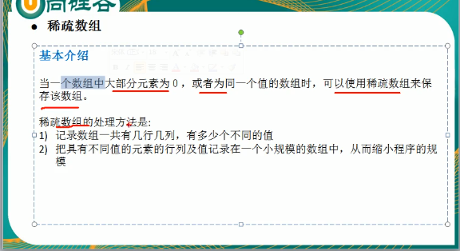
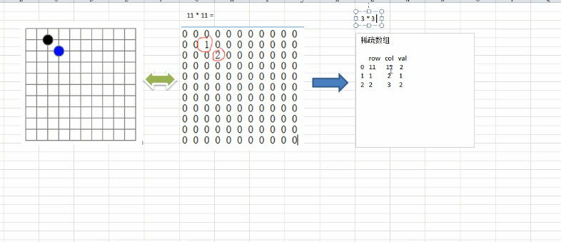
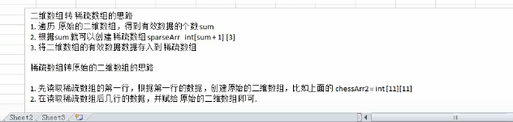
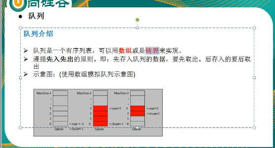
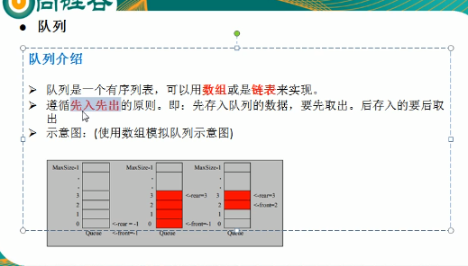
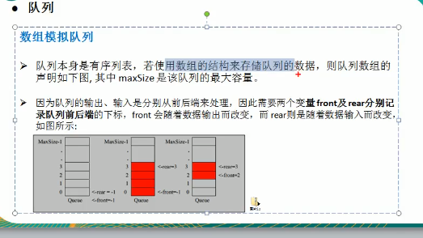

# **数据结构与算法**

数据结构

线性结构

顺序

链式


非线性结构

### 稀疏矩阵







```java
package data;

public class SparseArrayTest {
    //创建二维数组,11*11
    //0 表示没有棋子,1 表示黑子,2表示篮字
    public static void main(String[] args) {
     int spareArray[][] =new int[11][11];
     spareArray[1][2]=1;
     spareArray[2][3]=2;
        for (int[]  row:spareArray){
            for (int data: row){
                System.out.printf("%d\t",data);
            }
            System.out.println();
        }
//将二维数组转换为稀疏矩阵
        //先遍历二维数组,得到有效数字

        int sum=0;
        for (int i = 0; i <11 ; i++) {
            for (int j = 0; j <11 ; j++) {
                if (spareArray[i][j]!=0){
                    sum++;
                }
            }
        }

//初始化稀疏数组并对第一行赋值
        int sparseArray[][]=new int[sum+1][3];
        sparseArray[0][0]=11;
        sparseArray[0][1]=11;
        sparseArray[0][2]=sum;


//遍历二维数组,将非0的值存放在sparseArray中
        int count=0;//用于计数
        for (int i = 0; i <11 ; i++) {
            for (int j = 0; j <11 ; j++) {
                if (spareArray[i][j]!=0){
                    count++;
                    sparseArray[count][0]=i;
                    sparseArray[count][1]=j;
                   sparseArray[count][2]=spareArray[i][j];
                }
            }
        }
        //输出稀疏数组
        System.out.println();
        System.out.println("稀疏数组为------------");
        for (int i = 0; i <sparseArray.length ; i++) {
            System.out.printf("%d\t%d\t%d\t\n",sparseArray[i][0],sparseArray[i][1],sparseArray[i][2]);
        }
        System.out.println();


        //将稀疏数组变为二维数组
        int chessArr[][]=new int[sparseArray[0][0]][sparseArray[0][1]];

        for (int i = 1; i <sparseArray.length ; i++) {
            chessArr[sparseArray[i][0]][sparseArray[i][1]]=sparseArray[i][2];
        }
        //打印二维数组
        System.out.println("二维数组------------");
        for (int[]  row:chessArr){
            for (int data: row){
                System.out.printf("%d\t",data);
            }
            System.out.println();
        }


    }


}

```

### 队列







