# 七大设计原则

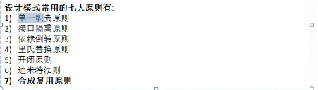

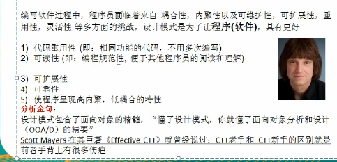

### 单一职责原则

​       **一个类只负责一项职责**,如果a类负责两个不同职责职责一,职责二,当职责一需求变更二导致职责二执行错误,所以选哟将类a的粒度分解为a1,a2.

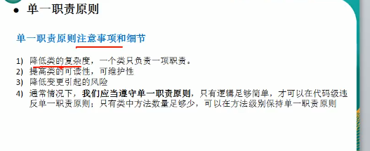

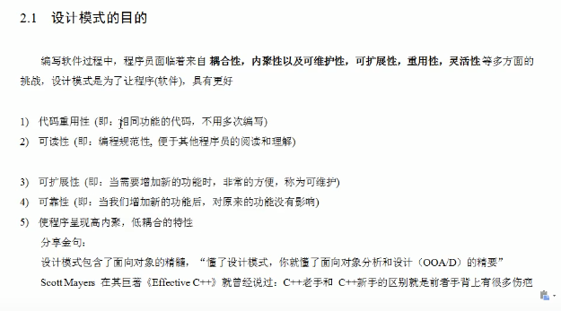

### 接口隔离原则

概念:

一个类对另一个的依赖应该用接口依赖

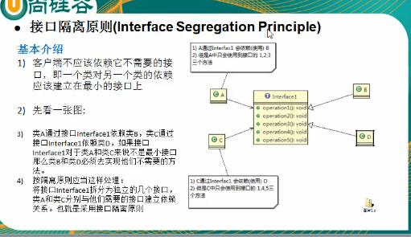

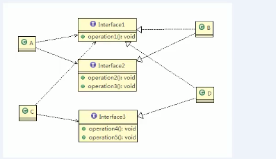

依赖倒转原则(抽象不依赖细节,细节应该依赖抽象)

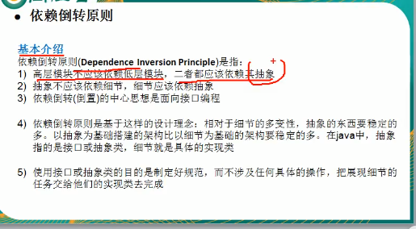

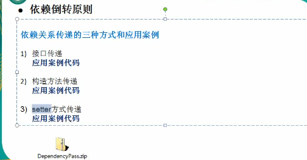

```java
package principle;
//接口传递
public class Inversion {
    public static void main(String[] args) {
        new OpenAndClose().open(new Changhong());

    }
}
interface IOpenAndClose{
    public void open(Itv tv);
}
interface Itv{
    public void play();
}
class Changhong implements Itv{

    @Override
    public void play() {
        System.out.println("长虹打开");
    }

}
//实现接口
class OpenAndClose implements IOpenAndClose{

    @Override
    public void open(Itv tv) {
        tv.play();
    }
}
```

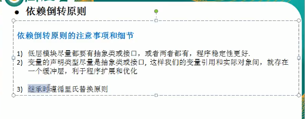

里氏替换(继承会增加耦合,所以需要更抽象的基类,父类与子类通过组合,内聚解决问题)

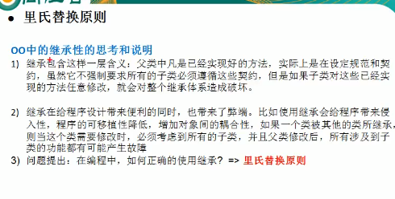

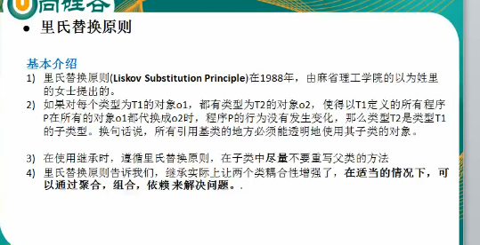

开闭原则(扩展而不是修改)

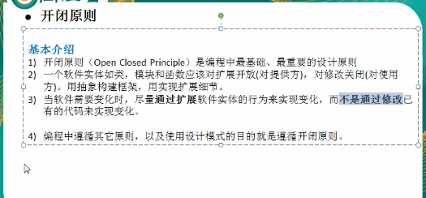

```java
package ocp;

public class ocp {
    public static void main(String[] args) {
        new GraphicEditor().drawShape(new Circle());
    }

}
class GraphicEditor{
    public void drawShape(Shape s){
        s.draw();
    }
}
abstract class Shape{
    int m_type;
    public abstract void draw();
}
class Rectangle extends Shape{
public Rectangle(){
    super.m_type=1;
}
    @Override
    public void draw() {
        System.out.println("矩形");
    }
}
class Circle extends Shape{

    @Override
    public void draw() {
        System.out.println("园");
    }
}
```

迪米特法则(最少知道原则)

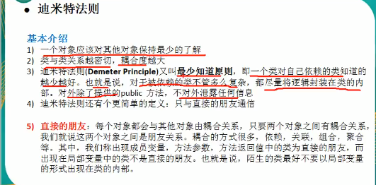

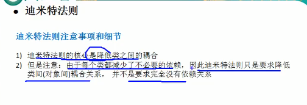

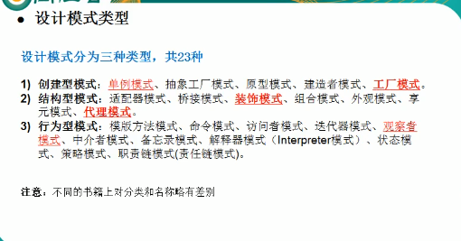

# 设计模式(是某类问题的通用解决方案)

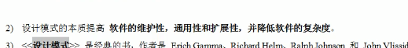

## 单例模式

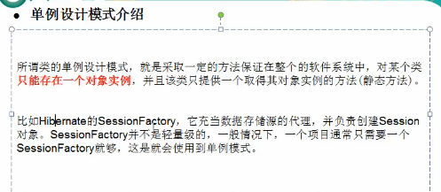

### 饿汉式(静态常量(可以用,会造成内存浪费))

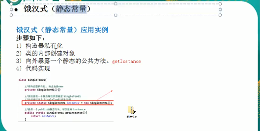

步骤

1 构造器私有化(防止new)

2 类的内部创建对象

3 向外暴露一个静态的公共方法 getInastance

4 代码实现

```java
class Singleton{
    private Singleton(){}//外部不能new

//本类内部创建对象实例
    private static final Singleton singleton=new Singleton();
//对外提供一个共有的静态方法,返回实例对象
    public static Singleton getInstance(){
        return singleton;
    }
}
```

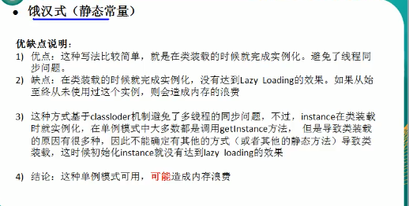

### 饿汉式(静态代码块)

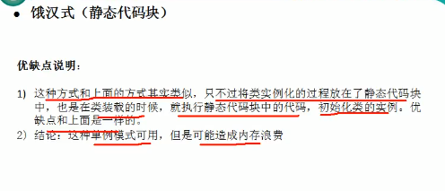

```java
//饿汉式(静态代码块)
class Singleton1{
    private static Singleton1 singleton1;
        static {//在静态代码块中创建单例
            singleton1=new Singleton1();
        }
        private Singleton1(){}
        public static Singleton1 getInstance(){
            return singleton1;
        }
}
```

### 懒汉式(线程不安全)

```java
//懒汉式(线程不安全)
class Singleton02{
    private static Singleton02 singleton02;
    private Singleton02(){}
    //懒汉式
    public static Singleton02 getInstance(){
        if (singleton02==null){
            singleton02=new Singleton02();
        }
        return singleton02;
    }
}
```

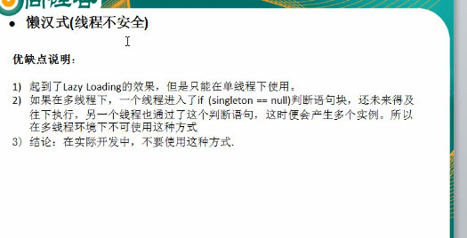

### 懒汉式(线程安全,效率低)

```java
//懒汉式(线程安全)
class Singleton03{
    private static Singleton03 singleton03;
    private Singleton03() {
    }
    //懒汉式
        public synchronized static Singleton03 getInstance () {
        if (singleton03 == null) {
            singleton03 = new Singleton03();
        }
        return singleton03;
    }
}
```

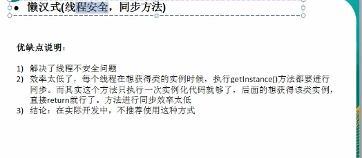

以下这种线程不安全:

​		懒汉式(线程安全,同步代码块)

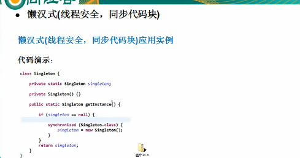

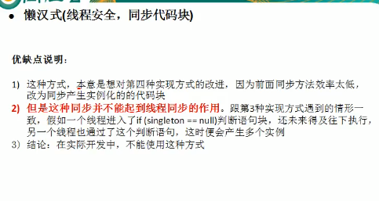

### 懒汉式双重检查线程安全(推荐)

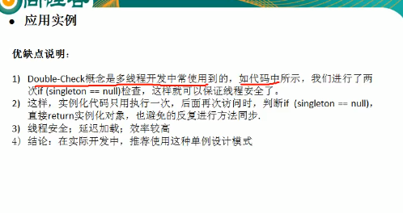

```java
/懒汉式 (双重检查)
class Singleton04 {
    private static volatile Singleton04 singleton04;

    private Singleton04() {}
    //懒汉式(双重检查)
    public static Singleton04 getInstance() {
        if (singleton04 == null) {
            synchronized (Singleton04.class) {
                if (singleton04 == null) {
                    singleton04 = new Singleton04();
                }
            }
        }
        return singleton04;
    }
}
```

### 静态内部类(线程安全(推荐)外部类加载的时候内部类不会立即加载)

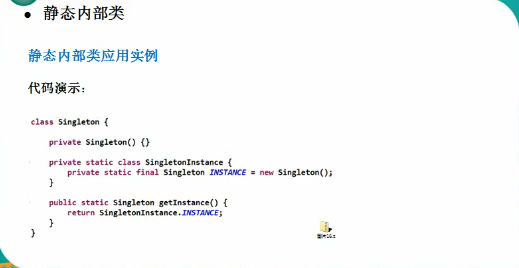

```java
//静态内部类实现单例
class Singleton05{
    private Singleton05(){}
    //
    private static  class SingletonInstance{
        private static final Singleton05 INSTANCE=new Singleton05();
    }
    public static Singleton05 getInstance(){
        return SingletonInstance.INSTANCE;
    }
}
```

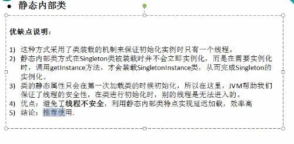

### 枚举实现单例(推荐)

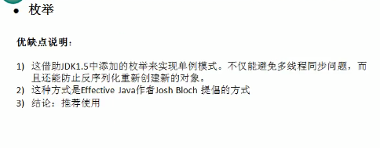

```
//枚举类单例
enum Singleton06{
    INSTANCE;
}
```

### 注意事项

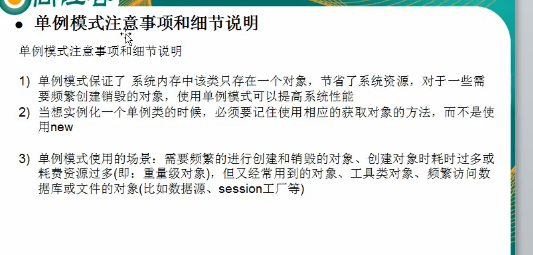