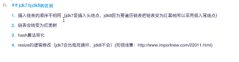
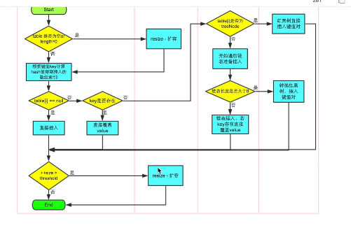
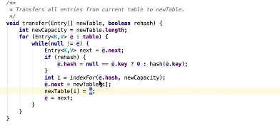

集合


集合

接口(里面只定义抽象方法,定义规范)

|

抽象类(里面一方面继承了接口的方法,一方面可以自己实现一部分通用方法)

|

普通类(也叫实现类,这种类是非常普通的,需要重写抽象类的所有方法)

list 代表有序可以重复的集合

set无序且不包含相同的元素

Hash(指哈希码的的一种算法/数据结构)

map保存映射

List的实现类: ArrayList LinkedList(数据结构)

ArrayList()


 

```java
package list.mylist;
class test{
    public static void main(String[] args) {
        MyList list=new MyList();
        list.add(1);
        list.add(2);
        list.add(3);
        list.add(4);
        list.add(5);
        list.add(6);
        list.add(7);
        list.add(8);
        list.add(9);
        list.add(10);
        list.add(11);
        list.add(12);
    }
}
public class MyList {
    //需要一个数组
    private Object[] elementData;
    //还需要一个size
    private int size;
    //初始化,采用构造方法
    public MyList() {
        //定义初始长度为10
        elementData = new Object[10];
    }
    public void add(Object obj){
        //判断,如果长度大于elementData的长度,我们就扩容
        if(size>=elementData.length){
          Object[] temp=new Object[elementData.length*2];
          //将原数组的内容copy到新的数组
            System.arraycopy(elementData,0,temp,0,size);
            elementData=temp;
        }
        //
        elementData[size++]=obj;
    }
}

```

LinkedList 链表结构

arrayList是加慢,遍历快

LinkedList 加快,遍历慢

头插最快

```java
package list.LinkedList;

import java.util.LinkedList;
import java.util.List;

public class MyLinkedList {
    private Node first;
    private Node last;
    private int size;
    public void add(Object obj){
        Node node=new Node();
        if (first==null){
            node.pre=null;
            node.next=null;
            node.setObj(obj);
        }else{
            node.pre=last;
            node.next=null;
            last.next=node;
            node.setObj(obj);
            last=node;
        }
    }
}

```

Hashmap

Hashmap是map的实现类

先通过获取key的hash值,然后通过hash值对数组的长度取余,

然后将v在数组中,如果有hash冲突,将数组下标的位置插入一个链表(jdk1.7采用头插法最快),此时将链表的头节点赋值到数组的此位置,(作用是将链表的头放在数组处).

更新是获取到hash值然后与链表遍历对比,并将链表更新.





实现Hashmap

```java
package map;


public class HashMapTest<K,V> {
    private Entry<K,V>[] table ;
    private static Integer CAPITICY=8;
    private int size=0;
    public HashMapTest(){
        table=new Entry[CAPITICY];
    }

    public int size() {
        return size;
    }

    public V put(K key, V value) {
        //算下标
        int hash = key.hashCode();
        int index = hash % table.length;
        for (Entry<K,V> entry = table[index]; entry != null; entry = entry.next) {
            if(entry.k.equals(key)){
                V oldValue=entry.v;
                entry.v=value;
                return oldValue;
            }
        }
        addMethod(key,value, index);
        return null;
    }

    private void addMethod(K key, V value, int index) {

        Entry entry=new Entry(key,value,table[index]);
        table[index]=entry;
        size++;
    }
    public V get(Object key) {
        //算下标
        int hash = key.hashCode();
        int index = hash % table.length;
        for (Entry<K,V> entry = table[index]; entry != null; entry = entry.next) {
            if(entry.k.equals(key)){
                return entry.v;
            }
        }
        return null;
    }


    class Entry<K,V>{
        private K k;
        private V v;
        private Entry<K,V> next;

    public K getK() {
        return k;
    }


    public void setV(V v) {
        this.v = v;
    }

    public Entry(K k, V v, Entry<K, V> next) {
        this.k = k;
        this.v = v;
        this.next = next;
    }

    public Entry() {
    }
}

    public static void main(String[] args) {
        HashMapTest<String, String> hashMapTest=new HashMapTest<String, String>();
        hashMapTest.put("123","zhangsan");
        System.out.println(hashMapTest.get("123"));
    }


}


```

泛型

```
泛型，即“参数化类型”。一提到参数，最熟悉的就是定义方法时有形参，然后调用此方法时传递实参。那么参数化类型怎么理解呢？
顾名思义，就是将类型由原来的具体的类型参数化，类似于方法中的变量参数，此时类型也定义成参数形式（可以称之为类型形参），
然后在使用/调用时传入具体的类型（类型实参）。
泛型的本质是为了参数化类型（在不创建新的类型的情况下，通过泛型指定的不同类型来控制形参具体限制的类型）。也就是说在泛型使用过程中，
操作的数据类型被指定为一个参数，这种参数类型可以用在类、接口和方法中，分别被称为泛型类、泛型接口、泛型方法。
```

```
泛型类型在逻辑上看以看成是多个不同的类型，实际上都是相同的基本类型。
```

```
泛型类、泛型接口、泛型方法
```





```
put函数底层调用了putVal进行数据的插入，对于putVal函数的流程大体如下。

　　① 判断存储的key、value是否为空，若为空，则抛出异常，否则，进入步骤②

　　② 计算key的hash值，随后进入无限循环，该无限循环可以确保成功插入数据，若table表为空或者长度为0，则初始化table表，否则，进入步骤③

　　③ 根据key的hash值取出table表中的结点元素，若取出的结点为空（该桶为空），则使用CAS将key、value、hash值生成的结点放入桶中。否则，进入步骤④

　　④ 若该结点的的hash值为MOVED，则对该桶中的结点进行转移，否则，进入步骤⑤

　　⑤ 对桶中的第一个结点（即table表中的结点）进行加锁，对该桶进行遍历，桶中的结点的hash值与key值与给定的hash值和key值相等，则根据标识选择是否进行更新操作（用给定的value值

替换该结点的value值），若遍历完桶仍没有找到hash值与key值和指定的hash值与key值相等的结点，则直接新生一个结点并赋值为之前最后一个结点的下一个结点。进入步骤⑥

　　⑥ 若binCount值达到红黑树转化的阈值，则将桶中的结构转化为红黑树存储，最后，增加binCount的值。

　　在putVal函数中会涉及到如下几个函数：initTable、tabAt、casTabAt、helpTransfer、putTreeVal、treeifyBin、addCount函数。下面对其中涉及到的函数进行分析。
```


```java
class ThreadList implements Runnable{
    //private static List<String> list=new ArrayList<>();会报concurrentMidificationExecption
    private static List<String> list=new CopyOnWriteArrayList<>();//写入并复制,添加效率低因为每次都会添加都会复制,开销大,不推荐,如果并发迭代可以用
    
    static {
        list.add("aa");
        list.add("bb");
        list.add("cc");
    }
    @Override
    public void run() {
        Iterator<String> iterator=list.iterator();
        while (iterator.hasNext()){
            System.out.println(iterator.next());
            list.add("ee");
        }

    }
}
```

