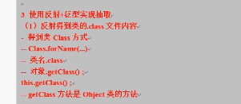
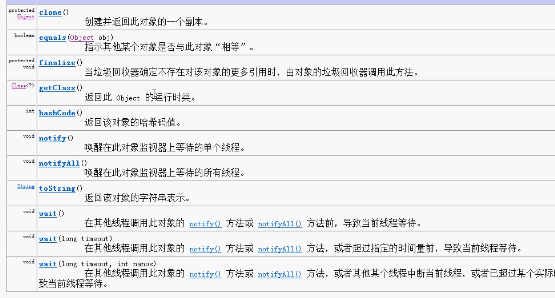
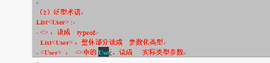
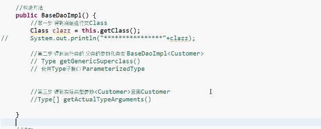
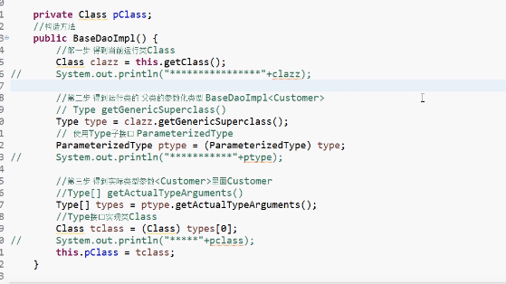
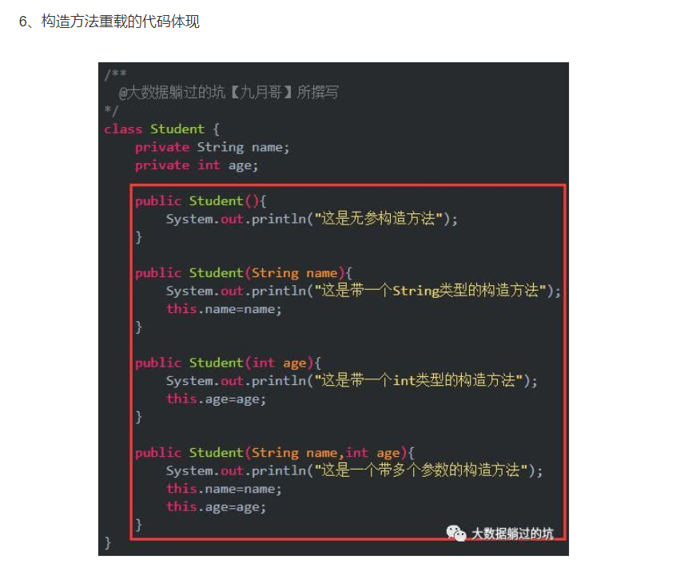

### class获取方法

### object类中的方法

### 泛型中的术语

### 构造方法

构造方法是一种特殊的方法,与一般不同方法不同的是

1 构造方法的名字必须和类名相同,没有返回值类型,甚至没有coid

2 构造方法的调用是在创建一个对象时使用new操作进行的,其作用是初始化对象

3 不能被static final synchronized ,abstract 和native修饰,构造方法不能被子类继承

2 作用: 对象初始化

3 特点

1 函数名与类名相同,不能定义返回值类型,没有具体的返回值

4 构造方法的注意事项,

系统默认提供无参

如果我们给出,系统不提供

构造方法可以重载

### 数据库范式

第一范式:所有属性不可分割

第二范式:非主属性都要和码有完全依赖关系(消除部分依赖)

第三范式:任何非主属性不依赖于其它非主属性。 (目的是实体拆分)(消除传递依赖。)

