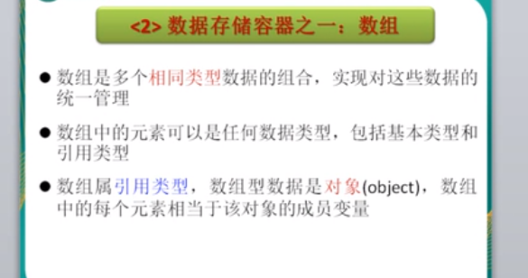
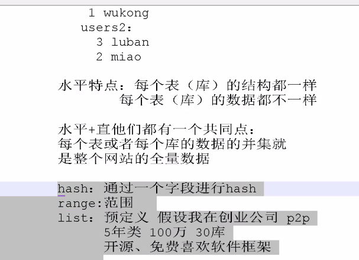

基础:

singleton

单例设计模式

唯一

面试mq

消息队列技术选型

为啥用,

解耦,异步,削峰

优点缺点

消息队列区别以及时合那些场景

java高并发

syc的原理

列举java中的锁

java设计模式

java线程池原理

数据结构

java混淆的概念

java框架篇

spring原理

springmvc和springboot的区别

对象原理:

当new 出来一个对象的时候,对象头的前56bit存的是 4 个存年龄,2个存锁的的状态,1个没用,一个偏向锁状态

2 个存同步状态

基础:

流程控制

顺序结构

从上到下

分支结构

if else

循环

while for

基础

Integer对象默认有-128-127的对象

stringbuffer没有重写equals方法

比较的object的对象引用

true

为什么读写分离

减少了主库读的压力

数据库的终极,分库分表

类型: 

垂直:

水平:

